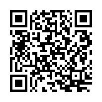

---
category: books
published: true
layout: post
title: 『 读书笔记 』 苏黎世投机定律
description: 仅仅是记录我个人的读书记录，看官不必在意～
---  

## 引言    

- 瑞士，贫瘠而多岩，国土面积相当于美国缅因州的一半，自然资源缺乏，没有石油，没有煤炭，甚至气候和地形也不太适合大多数农作物。但是三百多年来没有卷入任何一场欧洲战争，而且瑞士人是世界上最富有的国民之一，瑞士法郎也是世界上最强势的货币之一。
- 本书讲述瑞士人如何投机赚钱，并总结其中的一些经验。
- 人的一生不能逃避风险，而应当谨慎地投入风险。小心地去赌，保持收益大于损失的原则，去赌，去赢。
- 不要整天想着薪水，没有一个人能靠薪水发财，倒是有不少人因此而一贫如洗。所以你必须放手一搏，投机才是你所需要的。

## 定律一：论冒险 

如果你对从事的投机不感到忧虑，那么你冒的风险肯定不够。  
该定律要求你把钱投入到风险事业中，不要怕遭受损失。

- 大多数人紧紧抓着安全，仿佛他是世界上最重要的东西。
- 任何投机家都会告诉你，如果你一生的主要目标是避免忧虑，那么你将永远贫困。
- 生命应当是一场冒险活动，而不是一种单调的生活。
- 冒险会使生命更有价值，冒险的途径是把自己暴露于风险之中。
- 每种职业都有它的渴望和痛苦。
- 一切的投资都是投机，唯一的差异是有人承认，有人不承认。
- 苏黎世投机定律是讨论投机的，这一点毋庸置疑。他们绝不是要你疯狂地去冒险，只不过话说的比较直率而已。

***次要定律一***：始终要下有意义的赌注。

- 只下你负担得起损失的赌注。
- 在投机的过程中，一开始你就要有甘心承受损失的心理准备。

***次要定律二***：避免过分分散风险

- 分散风险会降低你的风险，但这也同时减少了你可能致富的希望。
- 你所投入的机会越多，就越需要更多的时间去研究，这额能会把你弄得焦头烂额。
- 千万不要为了多样化而分散资金，这样，你会变得像在超级市场里参加购物比赛一样，竞赛的目的只是快速装满篮子，回到家时却发现带了一堆昂贵但又不真正需要的物品。在投机中，你应该把钱放在值得冒险的事业里，永远不要为了分散风险的投资组合而从事太多项目的投机。

## 定律二：论贪婪

尽早获利了结。   
该定律推荐不要等到涨势的顶峰，不要希望获利会一直持续下去，不要希望好运气会连续不断，要有“好运气是短暂的”心理。在你达到预定的目标时，立即获利了结。即使你周围的所有人都说暴涨将持续下去，你也要坚持自己的做法。  

- 如果你能战胜贪婪，这种自制的行为将使你比其他99%的追逐财富的人更能成为优秀的投机者。
- 减少贪婪，你将有更多致富的机会。
- 一旦渴望变得杂乱无章甚至失去控制，并达到一定程度时，它就会战胜你的意志，这就是贪婪。
- 不要过度压榨你的运气。
- 你总会有短暂的连续盈利的时候，千万不要让贪婪抓住了你。
- 遵守贪婪定律，对某些人而言非常困难，主要困难可能就是怕后悔。
- 永远不要去核对已经卖掉股票的股价。

***次要定律三***：预先决定利润目标，目标达成后，立即获利了结。

- 到底赚多少才算够？贪婪是这个问题如此难解的主要原因，不管一个人已经拥有多少，他总是还要更多。
- 钱来得太快会让你感觉这笔钱本来就应该是你的。

## 定律三：论希望  

船开始下沉时，不要祷告，赶紧脱身。
定律三告诉我，当困难到来时，不要等待，果断地离开它。
定律二告诉我们当事情顺利时该怎么办，而定律三要说的是，当情况不好时该如何拯救自己。

- 当你知道自己是怎么失败的时候，你就离成功不远了。
- 一个业余的赌徒只会希望或祈祷好牌发到自己手里，但是职业赌徒研究的却是如何在逆境中生存。
- 知道如何从困境中解脱，可能是最可贵的投机天赋。
- 记住，当船刚开始下沉时，而不是等到已经下沉一半时，镇定地逃离这艘船，保全自己。
- 拒绝认错本身就是最大的错误。

***次要定律四***：欣然接受小的损失，这是生活的一部分；尽管经历多次失败，但要设法一次振作。

- 如果你能坦然地停止损失，你将会很好地保护自己，你可能永远不会受到严重的伤害。
- 只要等待，一切终会发生。

## 定律四：论预测

人类的行为不能预测，不要相信任何未卜先知。  
定律四告诉我们不要依靠预测来决定你的投机计划，因为它起不了作用。

## 定律五：论模式

在没有显示秩序之前，混乱并不危险。
定律五警告你，不要去设想一种模式，模式并不存在。

- 当你感觉到一个有秩序的世界正在形成时，你已经处于危险之中了。
- 真实情况是：金钱世界从未有过秩序，甚至是混乱得没有条理的世界。
- 为什么人们不可能找到投资的公式，原因是这个公式根本不存在。

***次要定律五***：警惕历史会重演的心理暗示。

- 历史的缺陷是一种特殊的对模式的幻想。
- 不要跌进这个陷阱，历史有时候的确会重演，但大多数时候它不是这样的。

***次要定律六***：谨防图表分析的幻觉。
***次要定律七***：不要妄作因果关系。

- 出发你能确切地看到一个原因在起作用，是真的看到它，否则你就要以最怀疑的态度看待所有的因果设想。

***次要定律八***：勿犯赌徒的荒谬心理。

- 你持续扔硬币，迟早会得到正面。但是在这个过程中并无规律可言，你不能预先知道它将何时开始，当它开始后，你也不会知道它将持续多久。

## 定律六：论灵活

避免扎根，他们会妨碍你的灵活。
定律六要你保持灵活性，它告诫你，要避免因为扎根而丧失投机机会，比如忠诚的情感、持续等待回报的行为。

***次要定律九***：不要因为一起活练就的情绪而驻足于已经没有希望的投资活动。
***次要定律十***：如果有更吸引人的机会出现，要毫不迟疑放弃原来的事物。

- 如果你根植于某些投机活动，它将迟早有损于你赚钱的目标。
- 永远不要留恋旧事物，但是别忘了老朋友。

## 定律七：论直觉

如果一个预感可以被解释，那么它就是指的依赖的。
定律七认为，嘲笑和一味相信预感都是错误的。虽然直觉不会都是正确的，但如果以谨慎和怀疑的态度对待它，它可能就是一个有利的投机工具。

***次要定律十一***：绝对不要把希望和直觉混为一谈。

## 定律八：论神秘主义

上帝创造世界的计划中，未必包括使你发财。

***次要定律十二***：占星术要是灵的话，占星学家们早就富裕了。
***次要定律十三***：不要过度迷信，如果你能泰然处之，也可以从中享受到一些乐趣。

## 定律九：论乐观与悲观

乐观就是预期最好的情况会发生，信心则是知道如何处理最坏的状况。绝不要仅仅因为乐观而采取投机活动。
定律九警告，乐观可能是投机者的敌人，它会使人感觉良好，因此它是危险的。

- 将乐观应用于金钱冒险时，你就需要警惕了。这是一种危险的心理状态。
- 知道如何处理最坏的情况，那就是信心。
- 在你感到乐观时，判断一下，这种愉快的感觉是不是真正见过了事实的证明。

## 定律十：论舆论

藐视大多数人的意见，因为他们很有可能是错的。
定律十教会我们，大多数人虽然不会一直主动滴犯错，但是犯错的机会还是比较大滴。
务必警惕不假思索地采取与大多数人相同或不同的立场，尤其是前者。

- 真理通常由少数人掌握，而不是由多数人发现的。

***次要定律十四***：不要追逐投机的风潮，最好的购买机会常常是没有人注意到他的时候。

- 当你周围的人都在冲你喊“不”的时候，你要想“是”是一件很困难的事情。
- 当还没有一时到事情将如何发生的时候，新手早已被大多数人推动了。

## 定律十一：论固执

如果第一次没能赚到钱，忘掉他，重新再来。
毅力是一种很好的品质，但不可随便运用到投机活动中。

- 毅力对我们日常生活的很多方面都有帮助。在投机活动中，它有时可以引导你走向成功，但有时也会使你陷入困境。

***次要定律十五***：绝对不要用摊平法挽救失败的投资。

## 扫一扫     

