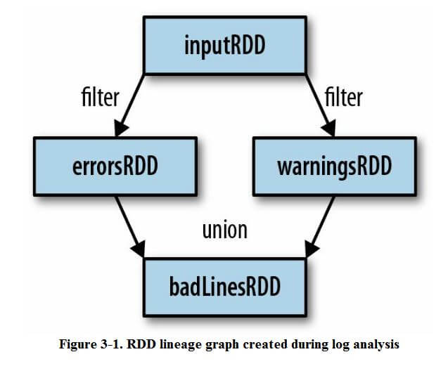
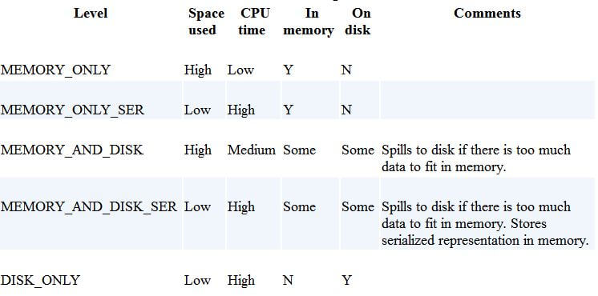

## 
## 0. 写在前面
代码示例在 [databricks/github](https://github.com/databricks/learning-spark)

## Chapter 1. Introduction to Data Analysis with Spark

### What is Apache Spark

- Designed to be fast and general-purpose.
- Extends MP model, more computations, interactive query, streaming.
- Run computations in memory, also do well in data on disk.
- Easy to use, Python, Java, Scala and SQL, can access HDFS and Cassandra and so on.

### A Unified Stack

- Spark contains mutiple closely integrated components.
- Tight integration's benefits.
    + All components in the stack benefit from improvments at the lower layers.
    + The cost associated with running the stack are minimized.
    + Build app that seamlessly combine different models.
- Spark stack grpah:


### Spark Core

- The basic functionality of spark:
    + Task scheduling
    + Memory management
    + Fault recovery
    + Interacting with storage system
    + RDD definition

## Chapter 2. Downloading Spark and Getting Started

- Spark itself is written in scala, and runs on the Java Virtual Machine. Need Java 6 or newer, if write Python, need Python 2.6 or 2.7, does not yet support Python 3.

### Using IPython

- IPYTHON: set this environment variable to 1 will use the IPython shell to access Spark when ./bin/pyspark
- IPYTHON_OPTS: set this environment variable to "notebook" will use the IPython notebook to access Spark when ./bin/pyspark

### Introduction to Core Spark Concepts

- Driver program: Contains the app's main function and defines distributed datasets on the cluster, then applies operations to them. In shells, the driver program is the Spark shell itself.
- Driver program access Spark through a SparkContext object, which represents a connection to a computing cluster.

## Chatper 3. Programming with RDDs

- An RDD is simple a distributed collection of elements, in Spark all work is expressed as either creating new RDDs, transforming RDDs or calling operations on RDDs to compute a result.
- Two ways to create RDDs: 
    + Loading an external dataset;  
    + Parallelizing a collection in your driver program, not that widely used since it required that you have your entire dataset in memeory on one machine;
- RDD.filter() does not mutate the existing inputRDD, it just retures a pointer to an entirely new RDD, inputRDD can still be reused later in the program. For example, the execute graph of printing the error and warn message in a logfile is as bellow:

```
errorsRDD = inputRDD.filter(lambda x: "error" in x)
warningRDD = inputRDD.filter(lambda x: "warn" in x)
badLinesRDD = errorsRDD.union(warningRDD)
```



- Actions: The operations that return a final value to the driver program or write data to an external storage system. Should note that each time we call a new action, the entire RDD must be computed "from scratch", to avoid this inefficiency, users can persist intermediate results.
- Lazy evaluation: Spark will not begin to execute until it sees an action. 

### Persistence(Cache)

- If wish to use the same RDD mutiple times, Spark will recompute the RDD and all of its dependencies each time we call an action on the RDD, it's expensive for iterative algorithm, so that we need persist or cache data.
- The for cache level, defined in pyspark.StorageLevel or org.apache.spark.storage.StorageLevel:



- The default persist() will store the data in the JVM heap as unserialized objects, in Python, we always serialize the data persist stores, so the default is instead stored in the JVM heap as pickled objects, when write data out to disk or off-heap storage, the data is also always serialized. Off-heap caching is experimental and uses Tachyon.

- The ability to always recompute an RDD is actually why RDDs are called "resilient", when a machine holding RDD data losts, it can be recomputed the missing data.

## Chapter 4. Working with Key/Value Pairs

- Key/Value RDDs are commonly used to perform aggregations, and often we'll do some initial ETL(extract, transform, load) to get our data into a key/value format.
- The advanced feature that lets users control the layout of pair RDDs across nodes is partitioning. Using controllable partitioning, applications can sometimes greatly reduce communications costs by ensuring that data will be accessed together and will be on the same node. 

### Data Partitioning(Advanced)

- Partitioning is important but not necessary for all applications, for if a given RDD is scanned only once, there is not point in partitioning it in advance. It's very useful when a dataset is reused multiple times in key-oriented operations such as joins. 
- There is a good example in the book, bellow is the comparison: 
    + Before


+ After


- partitionBy() is a transformation, RDDs can never be modified once created. Therefore need to persist and save as userData the result of partitionBy(), not the original sequenceFile(). Also, the 100 passed to partitionBy represents the number of partitions, which will control how many parallel tasks perform further operations on the RDD, in general, make this at least as large as the number of cores in your cluster.
- There is a PageRand example in this chapter.

## Chapter 5. Loading and Saving Your Data

This chapter will cover three common sets of data sources:

- File formats and filesystems;
- Structured data sources through Spark SQL;
- Databases and key/value stores;

### File Formats


- Spark supports reading all the files in a given directory and doing wildcard expansion on the input(e.g., part-*.txt).
- Use sc.textFile or sc.wholeTextFiles to load text files.
- Use saveAsTextFile to outputting files to a directory of file.

### JSON

- The simplest way to load JSON data is by loading the data as a text file and then mapping over the values with a JSON parser.
- Use accumulators to keep track of the number of errors.
- Save as json is much simpler, bellow is how to load and save as json in Python.

```
### load from json
import json
data = input.map(lambda x: json.loads(x))

### save as json
(data.filter(lambda x: x["lovesPandas"]).map(lambda x: json.dumps(x)).saveAsTextFile(outputFile))
```

### Comma-Separated Values and Tab-Separated Values
### SequenceFiles

- SequenceFiles are a popular Hadoop format composed of flat files with key/value pairs. It's a common input/output format for Hadoop MR jobs.
- Hadoop's RecordReader reuses the same object for each record, so directly calling cache on an RDD you read in like this can fail; instead, add a simple map() operation and cache its result. Furthermore, many Hadoop Writable classes do not implement java.io.Serializable, so for them to work in RDDs we need to convert them with a map() anyway. 
- Use sequenceFile(path, keyClass, valueClass, minPartitions) to load sequenceFiles, make sure that keyClass and valueClass should be the Writable class. e.g in Python:

```
data = sc.sequenceFile(inFile, 'org.apache.hadoop.io.Text', 'org.apache.hadoop.io.IntWritable')
```

### Hadoop Input and Output Formats
### File Compression
### Local FS

- Load data from 'local' fs required that all the files are available at the same path on all nodes in your cluster. 
- Some network filesystems are exposed to the user as a regular filesystem, if your data is already in one of these systems, can use it as an input by specifying a file:// path, Spark will handle it as long as the filesystem is mounted at the same path on each node. 
- If your file isn't already on all nodes in the cluster, you can load it locally on the driver without going through Spark and then call parallelize to distribute the contents to workers. This approach can be slow, so recommend put files in a shared filesystem, like HDFS, NFS or S3.  

### HDFS

- HDFS is designed to work on commodity hardware and be resilient to node failure while providing high data throughout. Using Spark with HDFS is as simple as specifying hdfs://master:port/path for your input and output.
- The HDFS protocol changes across Hadoop versions, so if you run a version of Spark that is compiled for a different version it will fail.

### Structured Data with Spark SQL

- Give Spark SQL a sql query to run on the data source, and we get back an RDD of Row objects, one per record.

### Apache Hive

- Hive can store tables in a variety of formats, from plain text to column-oriented formats.
- To connect Spark SQL to an Hive, configuring your Hive by coping hive-site.xml file to Spark's ./conf/ directory. Then you can create a HiveContext object, the entry point to Spark SQL, and write Hive Query Language to get data back as RDDs of rows.
- An example of HQL:


### Databases

- Spark can access databases using either their Hadoop connectors or custom Spark connectors. We'll show four common connectors.

### Java Database Connectivity

- Load relational data that support JDBC, MySQL, Postgres and so on.
- Get an org.apache.spark.rdd.JdbcRDD and provide it with our SparkContext and the other parameters. Bellow is a example in scala:


### Cassandra

- Maintained by DataStax open source project, currently not the official part of Spark.

### HBase

### Elasticsearch

- Different than the other connectors we have examined, it ignores the path information we provide and instead depends on setting up configuration on our SparkContext.

## Chapter 6. Advanced Spark Programming

- Introduce two types of shared variables:
    + accumulators to aggregate information;
    + broadcast variables to efficiently distribute large values;
- Cover Spark's methods for interacting with external programs, such as written scripts in R.  
- In addition to the languages directly supported by Spark, the system can call into programs written in other languages. We introduce how to use Spark's language-agnostic pipe() method to interact with other programs through standard input and output.

### Accumulators

- When we normally pass functions to Spark, such as map or filter, then can use variables defined outside them in the driver program, but each task running on the cluster gets a new copy of each variable, and updates from these copies are not propageted back to the driver. Spark's shared variables, accumulators and broadcast variables, relax this restriction for two common types of communication patterns: aggregation of results and broadcasts.
- Accumulators provide a simple syntax for aggregating values from worker nodes back to the driver program. One of the most common uses of accumulators is to count events that occur during job execution for debugging purposes.
- E.g in Python:


- Accumulators work as follows:
    + create by: SparkContext.accumulator(initalValue), returning an org.apache.spark.Accumulator[T] object;
    + Worker node in Spark closures can add to the accumulator with its += method(or add in Java);
    + The driver program can call the value property on the accumulator to access its value.
- Worker nodes can not access the accumulator's value(), that is, accumulator are write-only to the tasks on the worker nodes.

### Accumulators and Fault Tolerance

### Custom Accumulators

### Broadcast Variables

- Broadcast variables allow the program to efficiently send a large, read-only value to all the worker nodes for use in one or more Spark operations. For example, when app needs to send a large, read-only lookup table to all the nodes, or even a large feature vector in a machine learning algorithm.
- E.g in Python without broadcast variable:


- This program above can run, but if we had a larger table, the signPreFixes could easily be much larger, making it expensive to send that Array from the master alongside each task. In addition, if we used the same signPrefixes object later, it would be sent again to each node. We can fix this by making signPrefixes a broadcast variable.
- E.g in Python with broadcast variable:


- The process of using broadcast variables is bellow:
    + Create a broadcast[T] by SparkContext.broadcast;
    + Access its value with the value property;
    + The variable will be sent to each node only once, and should be treated as read-only(update will not be propagated to other nodes.)

### Working on a Per-Partition Basis

### Piping to External Programs

- Spark provides a general mechanism to pipe data to programs in other languages.
- Spark provides a pipe() method on RDDs, it lets us write parts of jobs using any language we want as long as it can read and write to Unix standard streams. 

## Chapter 7. Running on a Cluster

- The driver's duties are:
    + Converting a user program into tasks;
    + Scheduling tasks on executors;
- Executor have two roles:
    + Run the tasks that make up the application and return results to the driver;
    + Provide in-memory storage for RDDs that are cached by user program through a service called the Block Manager that lives within each executor.

### Drivers and Executors in Local Mode

### Cluster Manager

- Spark's documentation consistently uses the terms driver and executor when describing the processes that execute each Spark application, the terms master and worker are used to describe the centralized and distributed portions of the cluster manager.

- The exact steps that occur when you run a Spark app on a cluster:
    + The user submits an app using spark-submit;
    + spark-submit launches the driver program and invokes the main() method specified by the user;
    + The driver program contacts the cluster manager to ask for resources to launch executors;
    + The cluster manager launches executors on behalf on the driver program;
    + The driver process runs through the user application, based on the RDD actions and transformations in the program, the driver sends work to executors in the form of tasks
    + Tasks are run on executors processes to compute and save results;
    + If the driver's main() method exits or it calls SparkContext.stop(), it will terminate the executors and release resources from the cluster manager;


### Deploying Applications with spark-submit

### Packaging Your Code and Dependencies

- If your program imports any libs that are note in the org.apache.spark package or part of the language library, you need to ensure that all your dependecies are present at the runtime of your Spark application;
- For Python users, there are a few ways to install third-party libs, since pyspark uses the existing Python installation on worker machines, you can install dependency libs directly on the cluster machines using standard python package managers, or via a manually installation into the site-packages/ directory of your Python installation. Alternatively, you can submit individual libs using the -py-files argument to spark-submit and they will be added to the Python interpreter's path. Adding libs manually is more convenient if you do not have access to install packages on the cluster, but do keep in mind potential conflicts with existing packages already installed on the machines.

### Scheduling Within and Between Spark Applications

### Standalone Cluster Manager 

- Can start a master and workers by hand or by using launch scripts in Spark's sbin directory. The launch scripts are the simplest option to use, but require SSH access between your machines. To use the scripts, follow these steps:
    + Copy a compiled version of Spark to the same location on all your machines;
    + Set up password-less SSH access from your master machine to the others. This requires having the same user account on all the machines, creating a private SSH key for it on the master via ssh-keygen, and adding this key to the .ssh/authorized_keys file of all the workers. 
    + Edit the conf/slaves file on your master and fill in the workers' hostnames;
    + To start the cluster, run sbin/start-all.sh on your master, if everything started, you should get no prompts for a password, and the cluster manager's web UI should appear http://masternode:8080 and show all your workers;
    + To stop the cluster, run sbin/stop-all.sh on your master node;

- To start the cluster manually, using the spark-class script in Spark's bin/ directory:
    + master: bin/spark-class org.apache.spark.deploy.master.Master
    + worker: bin/spark-class org.apache.spark.deploy.worker.Worker spark://masternode:7077

### Submitting Applications

- If the application is requesting more memory for executors(with the --executor-memory flag to spark-submit) than is avialable in the cluster. The standalone cluster manager will never allocate executors for the application.
- Two deploy modes supported by standalone cluster:
    + Client mode: defalut, the driver runs on the machine where you executed spark-submit, as part of the spark-submit command.
    + Cluster mode: the driver is launched within the standalone cluster, as another process on one of the worker nodes, and then it connects back to request executors. In this mode, spark-submit is "fire-and-forget" in that you can close you laptop while the app can still running. Switching to cluster mode by passing --deploy-mode cluster to spark-submit.
- When sharing a spark cluster among multiple applications, you will need to decide how to allocate resources between the executors, in the standalone cluster manager, resource allocation is controlled by two settings:
    + executor memory: configure it by --executor-memory of spark-submit; default is 1 GB;
    + maximum number of total cores: The total cores across all executors for an application. Default is unlimited, that is, the application will launch executors on every available node is the cluster. For a multiuser workload, you should instead ask uses to cap their usage. You can set this value through the --total-executor-cores argument to spark-submit, or by configuring spark.cores.max in you Spark configuration file;
- The standalone cluster manager works by spreading out each application across the maximum number of executors by default.
- Use Apache ZooKeeper(a distributed coordination system) to keep multiple standby masters and switch to a new one when any of them fails in order to make HA.

## Chapter 8. Tuning and Debugging Spark

### Configuring Spark with SparkConf

- A SparkConf instance contains key/value pairs of configuration options the user would like to override. Every configuration option in Spark is based on a string key and value.
- The spark-submit tool provides built-in flags for the most common Spark configuration parameters and a generic --conf flag that accepts any Spark configuration value.
- spark-submit also supports loading configuration values from a file, this can be useful to set environmental configuraion, which may be shared across multiple uses, such as a default master. By default, spark-submit will look for a file called conf/spark-defaults.conf in the Spark directory and attempt to read whitespace-delimited key/value pairs from this file. You can also customize the exact location of the file
- using the --properties-file flag to spark-submit.
- The precedence of configuration: SparkConf instance > spark-submit arguments > spark-submit configuration file;

### Components of Execution: Jobs, Tasks, and Stages

### Finding Information


## 扫一扫     

