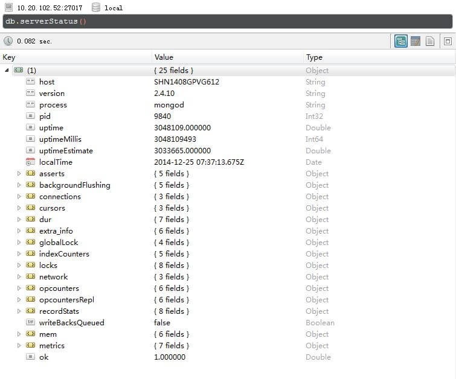
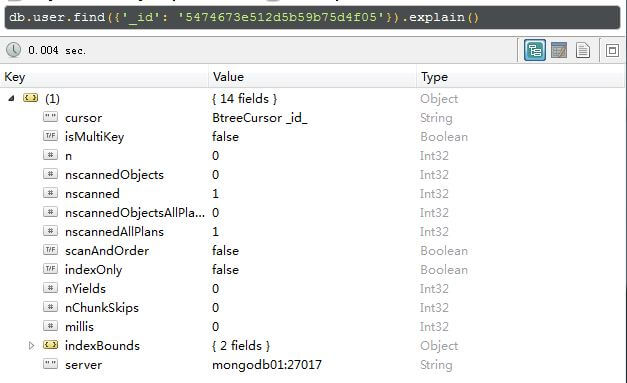

---
category: db
published: false
layout: post
title: 记录MongoDB一些优化方法
description: 整理网上收集到的和一些项目中用到的MongoDB优化策略～
---  

## 1. 决定是否优化sd

### 1.1 使用MongoDB自带的explain命令查看查询性能  
　　下面是我在本地测试的一个例子。    

    > db.user.find({'user':'taotao.li@datayes.com'}).explain()         
    {             
            // 返回游标类型(BasicCursor | BtreeCursor | GeoSearchCursor | Complex Plan | multi)                                                         
            "cursor" : "BasicCursor",
            // 是否使用多重索引(true | false)                                     
            "isMultiKey" : false,    
            // 返回的文档数量   (number)                                      
            "n" : 1,    
            // 被扫描的文档数量，这个值小于或等于nscanned   (number)                                                   
            "nscannedObjects" : 9,
            // 被扫描的文档数量，我们应该尽量使这个值和上面提到的n的值相近    (number)                                          
            "nscanned" : 9,    
            // 这个值表明在进行一次查询时，数据库计划扫描的文档数量 (number)                                            
            "nscannedObjectsAllPlans" : 9,                                
            "nscannedAllPlans" : 9,    
            // 若为true，表示查询不能利用文档在索引里的排序来返回结果，用户需要手动对返回进行排序操作，反之(true | false)                                     
            "scanAndOrder" : false,    
            // 若为true，表示查询是充分利用了现有的索引的，在设计索引的时候，应该尽量确保热点查询都利用到了已有的索引(true | false)                                     
            "indexOnly" : false,   
            // 表示查询语句执行时写锁的等待时间  (ms)                                       
            "nYields" : 0,          
            // 在分片的时候可以通过这个字段看分片的效果 (number)                                       
            "nChunkSkips" : 0, 
            // 耗时 (ms)                                               
            "millis" : 65,    
            // 所使用的索引 (dict of dict)                                             
            "indexBounds" : {                                             
                                                                          
            },        
            // mongo所在的服务器地址                                            
            "server" : "SHN1408GPVG612:27017"                             
    }                                                                

### 1.2 使用MongoDB自带的profile优化器查看查询性能  
　　MongoDB Database Profiler是一种慢查询日志功能,可以作为我们优化数据库的依据.
开启Profiling功能,有2种方式可以控制Profiling的开关盒级别。  

- 启动MonggoDB时加上 `-profile=级别` 即可  
- 在客户端调用db.setProfilingLevel(级别)命令来实时配置     

　　Profiler信息保存在system.profile中.我们可以通过db.getProfilingLevel()命令来获取当前的Profile级别。profile的级别有4个，分别是-1、0、1、2，默认没有开启。

- -1: 返回当前设置的级别  
- 0： 表示不开启  
- 1： 表示记录慢命令(默认为>100ms)
- 2： 表示记录所有命令

　　下面是我运行profile的一个示例及各个字段的解释： 

    > db.system.profile.findOne()
    {
        //操作类型：insert | query | update | remove | getmore | command
        "op" : "query",
        //进行op操作的地方，比如现在是说在community数据库的system集合的indexes中进行了一次查询操作
        "ns" : "community.system.indexes",
        "query" : {
                "expireAfterSeconds" : {
                        "$exists" : true
                }
        },
        "ntoreturn" : 0,
        "ntoskip" : 0,
        "nscanned" : 2,
        "keyUpdates" : 0,
        "numYield" : 0,
        // 此次查询花在处理锁上的时间；其中R/W代表全局读/写锁，r/w代表数据库层面的读/写锁；
        "lockStats" : {
                "timeLockedMicros" : {
                        "r" : NumberLong(79),
                        "w" : NumberLong(0)
                },
                "timeAcquiringMicros" : {
                        "r" : NumberLong(1),
                        "w" : NumberLong(2)
                }
        },
        // 返回的文档数量
        "nreturned" : 0,
        // 返回字节长度，如果这个数字很大，考虑值返回所需字段
        "responseLength" : 20,
        // 查询所耗时间，这个时间是在mongo服务器端，从这个查询开始到查询结束；类似于一般程序执行的CPU时间；
        "millis" : 0,
        "ts" : ISODate("2014-11-19T09:33:58.965Z"),
        // 发起此次查询的远程地址
        "client" : "0.0.0.0",
        "allUsers" : [ ],
        // 执行此查询语句的用户，不知道这里为什么是空的
        "user" : ""
    }

### 1.3 使用MongoDB自带的mongostat优化器查看查询性能    
　　下面是我本地测试的一个mongostat示例即相关字段含义：  

    D:\mongodb-2.4.10\bin
    λ mongostat.exe
    connected to: 127.0.0.1
    insert  query update delete getmore command flushes mapped  vsize    res faults  locked db idx miss %     qr|qw   ar|aw  netIn netOut  conn       time
        *0     *0     *0     *0       0     1|0       0   608m   1.4g    14m      1  test:3.3%          0       0|0     0|0    62b     3k    60   10:42:44
        *0     *0     *0     *0       0     1|0       0   608m   1.4g    14m      0  test:0.0%          0       0|0     0|0    62b     3k    60   10:42:45
        *0     *0     *0     *0       0     1|0       0   608m   1.4g    14m      0  test:0.0%          0       0|0     0|0    62b     3k    60   10:42:46
        *0     *0     *0     *0       0     1|0       0   608m   1.4g    14m      0  test:0.0%          0       0|0     0|0    62b     3k    60   10:42:47
        *0     *0     *0     *0       0     3|0       0   608m   1.4g    14m      0  test:0.0%          0       0|0     0|0   174b     3k    60   10:42:48
        *0     *0     *0     *0       0     1|0       0   608m   1.4g    14m      0  test:0.0%          0       0|0     0|0    62b     3k    60   10:42:49
        *0     *0     *0     *0       0     3|0       0   608m   1.4g    14m      0 local:0.0%          0       0|0     0|0   178b     3k    60   10:42:50

　　mongostat各个字段解释：    

- insert/query/update/delete/getmore：每秒执行这5个操作的次数；
- command：每秒执行指令的次数，在从数据库中，这个字段的值是一个以“|”分开的两个值，表示 local|replicated 数量；  
- flushes：每秒fsync操作的次数；  
- mapped：按照官方解释，这个字段表示上一次执行mongostat指令是所有数据的大小，应该是指所有数据占磁盘的大小，但似乎不是很对；  
- vsize：mongod服务占用的虚拟内存大小；  
- res：mongod所占用的物理内存；  
- faluts：page faults次数；
- index miss：索引缺失的数量； 
- qr/qw：表示在队列中等待的客户端，rw表示读写；  
- ar/aw：表示正在进行请求的客户端；  
- netIn/netOut表示网络流量，单位是字节；  
- conn：表示连接数；  
- repl：表示同步状态；  

### 1.4 使用MongoDB自带的db.serverStatus查看服务器状态   
　　这里输出的信息太多了，看一个Robomongo的截图吧，里面有几个字段也是很重要的。 

### 1.5 使用MongoDB自带的db.stats查看服务器状态   
　　说到这里，我突然发现监控MongoDB performance的工具真的挺多的，完全可以自己给予这些命令和工具来开发后台管理的工具啊。比如说stats这个命令，也提供了挺多的信息：  

    > db.stats()                                        
    {                                                   
            "db" : "community",                         
            "collections" : 7,   
            // 记录在数据库中的所有文档总数                       
            "objects" : 73,                
            // 数据库中所有文档的平均大小，等于 dataSize/objects             
            "avgObjSize" : 24965.424657534248,          
            // 数据库所有文档的总大小，以字节为单位
            "dataSize" : 1822476,                  
            // 分配给每一个文档的磁盘空间，奇怪这里为什么不是16MB     
            "storageSize" : 11943936,                   
            "numExtents" : 12,                          
            "indexes" : 4,                              
            "indexSize" : 32704,                        
            "fileSize" : 201326592,                     
            "nsSizeMB" : 16,                            
            "dataFileVersion" : {                       
                    "major" : 4,                        
                    "minor" : 5                         
            },                                          
            "ok" : 1                                    
    }                                                   

## 2. 优化Schema  
　　解决一个问题永远都有多种方法，且在产品的不同时期也会有不同的解决办法。但核心观点都不变：      

- 理解产品的核心应用；     
- 合理平衡数据库的读写，读写比例很大程度上决定你的Schema设计；   
- 避免随机性IO操作；   

　　即使是NoSQL，也无法避免一些数据库字段在关系上的建立。所以在设计NoSQL Schema的时候不可避免地要进行一些关系的处理。在MongoDB方面，处理关系有以下三种方法： 

- 数据库引用  
- 集合间的应用  
- 文档嵌套  

　　其中数据库引用很少用到，并且官方也不推荐这种用法。相对于集合间引用和文档嵌套，这个需要看具体设计。特别是在应用文档嵌套方式的时候，需要注意一个文档的最大容量是[16MB](http://docs.mongodb.org/manual/core/document/)。文章末尾的**6 Rules of Thumb for MongoDB Schema Design**详细介绍、对比了一些集合引用和嵌套文档方面的案例，**MongoDB Schema Design: Four Real-World Examples**介绍了MongoDB 4个真实的应用设计案例，有比较大的参考价值。

## 2.1 MongoDB 和 RDBMS的一些概念联系  
| RDBMS | MongoDB |
| ----- | ------- |
| Database | Database |
| Table | Collection |
| Row | Document |
| Index | Index |
| Join | Embedded Document |
| Foreign Key | Reference |

## 3. 查询优化  

### 3.1 建立索引  
　　首先要明确的是，mongo里会自动根据_id来创建一个唯一性索引，所以如果你是以_id为key来进行查询的话都会很快的。比如下面这个截图，nscanned为1。
  
　　database.collection.ensureIndex( { key : 1 } , { background : true } );   
　　说明：在数据库database里，对collection中的字段key建立索引，按照升序方式建立索引background参数设置为true时表示后台创建索引【建立索引略耗时】。    
　　索引是一把双刃剑啊，用得好不好，全看也许需求和数据库设计了，在设计索引前最好参考参考[官方文档](http://docs.mongodb.org/manual/core/indexes-introduction/)，而且最好要有一个建索引前后的performance的一些对比，talk is cheap, show me the data.    
　　总而言之，当需要建立索引的时候，一定要仔细思考下面几个方面：  

- 热点查询的数据是什么，可否用缓存替代；  
- 建立索引的顺序也会影响查询速度，参考: 10gen工程师谈MongoDB组合索引的优化；  
- 索引的更新周期，更新索引是一件很tricky的事情；  
- 索引建立后，是否能跟上后期系统扩展的脚步；  

### 3.2 限制返回数据  
　　使用limit，skip方式返回查询数据，只返回需要返回的数据。   

## 4. 总结  
　　在记录这篇文章的过程中，我发现监控mongo性能的工具还真的挺多的。但是现在我参与的产品中数据量还很少，还没有涉及到数据库这方面的优化，所以上面提到的这些都是自己在官网和一些优秀博客收集的资料。在后续涉及到自己优化这些查询的时候，我会再把实际经验和优化对比记录下来。

## 5. 一些资料  

- [mongodb性能优化](http://caizi.blog.51cto.com/5234706/1542480)   
- [6 Rules of Thumb for MongoDB Schema Design](http://blog.mongodb.org/post/87200945828/6-rules-of-thumb-for-mongodb-schema-design-part-1)  
- [MongoDB Schema Design: Four Real-World Examples](http://www.slideshare.net/friedo/data-modeling-examples)   
- [Optimization Strategies for MongoDB](http://docs.mongodb.org/v2.4/administration/optimization/)  
- [Database Profiler Output](http://docs.mongodb.org/v2.4/reference/database-profiler/)  
- [10gen工程师谈MongoDB组合索引的优化](http://www.csdn.net/article/2012-11-09/2811690-optimizing-mongodb-compound)   
- [dbStats](http://docs.mongodb.org/v2.4/reference/command/dbStats/)  

## 扫一扫     

