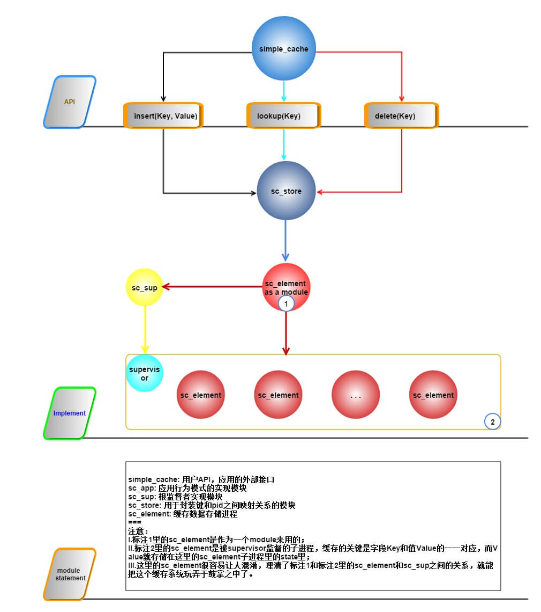
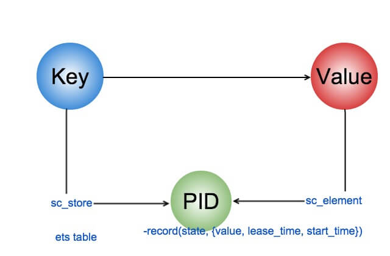

---
category: erlang  
published: true  
layout: post  
title: 一个完整的 OTP 应用 
description: 通过对一个简单、完整的OTP应用的学习和分析来进入OTP的世界~~ 
---  

 
## 1. 写在前面  
　　在实践 *Erlang and OTP in Action* 的第六章的时候，确实遇到了不少问题，后来慢慢多看了几遍书，多阅读了几次源码，特别是阅读了 application 的源码后，才慢慢理解了这章所讲的这个应用。这个总结不会很长，原本就想简单记在书上的，但想到以后也许会有一些更新，还有一些流程图的绘制需要经过多次修改，就还是放到github上来了，说实话，真挺感谢github的，让我学习和管理代码如此方便。

## 2. 程序运行流程  
　　下图是整个simple_cache应用运行的流程，我们先上图，然后在后面再说说重要的地方。

　　
　　下面我们再说明一下各个模块各自的职责：  

- sc_app: 应用行为模式的实现模块  
- simple_cache: 用户API，应用的外部接口  
- sc_store: 用于封装键和pid之间映射关系的模块  
- sc_element: 缓存数据存储进程  
- sc_sup: 根监督者实现模块  
	
　　其中sc_app并没有出现在流程图中，因为流程图是展示应用已经被启动后的运行流程，而sc_app是用于启动应用的，这点会单独在下一节讨论。现在先focus在应用成功启动后的运行流程。下面我们分别以insert，lookup，delete过程单独看一下流程。  

### 2.1 insert流程  
　　假设需要缓存的键为 K，值为 V。用户在API接口调用 `simple_cache:insert(K, V)`；simple_cache先调用sc_store:lookup(K) 检查这个键是否已经缓存，若缓存则更新键值为V，否则新建一个缓存进程。因为我们是第一次insert，所以会调用sc_element来新建一个进程，并将值 V 放到这个新建进程的状态里，这个状态被定义为一个记录```-record(state, {value, lease_time, start_time}).```；即sc_element新建的进程状态state中的value字段存储的就是我们需要缓存的键值 v。sc_element新建的进程PID会被返回，且返回后会被组合成(K, PID), 然后调用sc_store:insert(K, PID)来存储键K和进程的PID。(K, PID) 是存储到ets表里的。
　　从上面可以看到，其实使用进程做了一次中转类似的操作。我们原本要缓存一对键值k－v，现在是将k和进程pid单一映射，存储在ets表中，然后将值v存储到进程到状态state里。这样，当要拿到一个缓存的键值k－v时，先到ets表中查找k对应到进程pid，然后根据再读取这个进程到状态state即可。这个过程可以参考下图：


### 2.2 lookup流程  
　　其实lookup流程上面也提到了，即先根据k查找对应到pid，然后在以模块到方式调用sc_element来查找pid对应到进程到状态。这里可能大家很容易混淆标注1中的sc_element和标注2中supervisor监督的一系列sc_element自进程。其实一开始我也很纳闷，supervisor下有这么多sc_element自进程，可当调用sc_element来查找进程pid当状态时，是调用哪个自进程呢？这里其实是一个比较容易犯的低级错误，当调用sc_element来读取进程pid的状态时，是将sc_element当作一个模块来调用，和supervisor监督下的sc_element自进程毛线关系都没有，根本就不是一个概念呀。

### 2.3 delete流程  
　　至于delete流程，则非常简单了，调用流程如下：simple_cache:delete/1 -> sc_store:lookup/1 -> sc_element:delete/1 -> gen_server:cast/2 -> handle_cast/2.

## 3. OTP 应用的标准组织结构  

* doc  用于存放文档。如果文档时用EDoc生成，请将overview.edoc文件放在此处，其余的文件将会自动生成；
+ ebin  用于存放编译后的代码(.beam文件)，包含应用元数据的.app文件也应放在此处；
- include  用于存放公共头文件。所有作为公共API的一部分的.hrl文件都应该放在这个目录中。仅用于你自己的代码之中且不打算公开的私有.hrl文件则应该与其它源码文件一起放；
- priv  用于存放各种需要随应用一起发布的其他内容。定位priv目录的方法很简单：调用code:priv_dir(<application-name>)，便会以字符串形式得到priv目录完整路径；
- src  存放应用源代码；


## 4. 应用元数据描述文件说明  
　　[官方关于应用元数据描述文件的文档](http://www.erlang.org/doc/man/app.html)
　　我们的应用元数据如下：  



{application, simple_cache,
	[{description, "A simple caching system"},
	 {vsn, "0.1.0"},
	 {modules, [sc_app,
	 			sc_sup]},
	 {registered, [sc_sup]},
	 {applications, [kernel, sasl, stdlib]},
	 {mod, {sc_app, []}}}.



　　应用元数据文件里其实是定义了一个Erlang项式，这里真想吐槽一下，感觉这样写好麻烦，Python 里的配置文件多方面啊，简单易用。而Erlang应用元数据里的这个Erlang项式，是一个三元组{application, ApplicationName, ApplicationConfigureList}. application表示用application来启动，ApplicationName代表这个应用的名字，应该和应用元数据文件的文件名是一样的，ApplicationConfigureList是应用描述应用配置的信息，是一个列表类型。下面我们看看这个配置列表里的一些信息说明：  

- description：应用描述；  
- vsn：应用版本，推荐<主版本号>.<次版本号>.<修正版本号>的格式；  
- modules：应用中的模块列表，erlang的systools会用这个列表中的模块来制作启动脚本和应用程序包； 
- registered：需要在系统中注册的模块名字，常用于系统服务等场合，erlang的systools会检查这个列表里的模块是否有命名冲突；  
- application：必须在应用启动前先行启动的所有应用。主动应用要求自己所依赖的所有应用在自己的生命周期开始之前先行启动并就绪，这个列表中的各个应用的顺序无关紧要；  
- mod：告知OTP系统应该如何启动应用，该参数的值是一个元组，其内容为一个模块名和一些可选的启动参数；  

　　还有其他很多东西，今天就先不讲了，过几天再补上。


## 5. 感想  
　　理解这个OTP应用的关键是监督树的建立和sc_element作为模块来调用的方式。最近看了一些公司在实践erlang后又转向其他语言来实施项目的文章分享，心里确实对Erlang对前途不是很明确，但凡事都得多面对待，不能别人说不行你也说不行，不能过去说不行现在，将来也说不行。  
　　下面附上最近了解的小米和Facebook在Erlang的实践中的一些探索，仅供参考：

[1. 小米推送服务从Erlang转到java](http://www.infoq.com/cn/news/2014/11/xiaomi-1111-pushservice)
>
开发语言从Erlang 转为Java。 小米原来的消息系统是使用Erlang开发的，所以推送系统的第一版也是基于Erlang；但是Erlang的社区不够活跃，开发人员很难找，学习曲线陡，支持工具和类库少，所以后来开发团队选择了使用Java重新开发；迁移到Java后，对开发人员的要求降低，各种工具和类库较多，大大提高了开发效率。  

[2. 介绍FB一开始选用Erlang来开发聊天服务的原因](http://www.quora.com/Why-was-Erlang-chosen-for-use-in-Facebook-chat)

[3. 介绍FB聊天服务从Erlang转向C++的原因](http://www.quora.com/When-did-Facebook-switch-away-from-using-Erlang-for-Facebook-Chat)


## 扫一扫     

