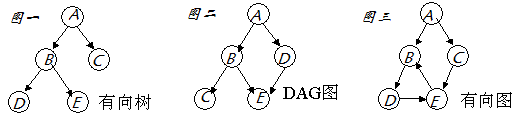

---
layout: post
published: true
title: 『 Spark 』4. spark 之 RDD
description: 要想学好spark，怎么能不先搞清楚RDD的来龙去脉呢～～～ 
---  

## 写在前面

本系列是综合了自己在学习spark过程中的理解记录 ＋ 对参考文章中的一些理解 ＋ 个人实践spark过程中的一些心得而来。写这样一个系列仅仅是为了梳理个人学习spark的笔记记录，所以一切以能够理解为主，没有必要的细节就不会记录了，而且文中有时候会出现英文原版文档，只要不影响理解，都不翻译了。若想深入了解，最好阅读参考文章和官方文档。

其次，本系列是基于目前最新的 spark 1.6.0 系列开始的，spark 目前的更新速度很快，记录一下版本号还是必要的。   
最后，如果各位觉得内容有误，欢迎留言备注，所有留言 24 小时内必定回复，非常感谢。     

Tips: 如果插图看起来不明显，可以：1. 放大网页；2. 新标签中打开图片，查看原图哦；3. 点击右边目录上方的 *present mode* 哦。

## 1. 什么是RDD 
先看下源码里是怎么描述RDD的。  

>>  
Internally, each RDD is characterized by five main properties:  
A list of partitions  
A function for computing each split   
A list of dependencies on other RDDs  
Optionally, a Partitioner for key-value RDDs (e.g. to say that the RDD is hash-partitioned)   
Optionally, a list of preferred locations to compute each split on (e.g. block locations for an HDFS file)   

可以知道，每个 RDD 有以下5个主要的属性：  

>>  
- 一组分片（partition），即数据集的基本组成单位  
- 一个计算每个分片的函数  
- 对parent RDD的依赖，这个依赖描述了RDD之间的 `lineage`  
- 对于key-value的RDD，一个Partitioner，这是可选择的  
- 一个列表，存储存取每个partition的preferred位置。对于一个HDFS文件来说，存储每个partition所在的块的位置。这也是可选择的  

把上面这5个主要的属性总结一下，可以得出RDD的大致概念：  

>>
首先，RDD 大概是这样一种表示数据集的东西，它具有以上列出的一些属性。是设计用来表示数据集的一种数据结构。为了让 RDD 能 handle 更多的问题，规定 RDD 应该是只读的，分区记录的一种数据集合。可以通过两种方式来创建 RDD：一种是基于物理存储中的数据，比如说磁盘上的文件；另一种，也是大多数创建 RDD 的方式，即通过其他 RDD 来创建【以后叫做转换】而成。而正因为 RDD 满足了这么多特性，所以 spark 把 RDD 叫做 `Resilient Distributed Datasets`，中文叫做弹性分布式数据集。很多文章都是先讲 RDD 的定义，概念，再来说 RDD 的特性。我觉得其实也可以倒过来，通过 RDD 的特性反过来理解 RDD 的定义和概念，通过这种由果溯因的方式来理解 RDD 也未尝不可，至少对我个人而言这种方式是挺好的。  

## 2. 理解RDD的几个关键概念   

本来我是想参考 RDD 的论文和自己的理解来整理这篇文章的，可是后来想想这样是不是有点过于细致了。我想，认识一个新事物，在时间、资源有限的情况下，不必锱铢必较，可以先 focus on 几个关键点，到后期应用的时候再步步深入。  

所以，按照我个人的理解，我认为想用好 spark，必须要理解 RDD ，而为了理解 RDD ，我认为只要了解下面几个 RDD 的几个关键点就能 handle 很多情况下的问题了。所以，下面所有列到的点，都是在我个人看来很重要的，但也许有所欠缺，大家如果想继续深入，可以看第三部分列出的参考资料，或者直接联系我，互相交流。

### 2.1 RDD的背景及解决的痛点问题   

RDD 的设计是为了充分利用分布式系统中的内存资源，使得提升一些特定的应用的效率。这里所谓的特定的应用没有明确定义，但可以理解为一类应用到迭代算法，图算法等需要重复利用数据的应用类型；除此之外，RDD 还可以应用在交互式大数据处理方面。所以，我们这里需要明确一下：`RDD并不是万能的，也不是什么带着纱巾的少女那样神奇。简单的理解，就是一群大牛为了解决一个问题而设计的一个特定的数据结构，that's all`。

### 2.2 What is DAG - 趣说有向无环图

DAG - Direct Acyclic Graph，有向无环图，好久没看图片了，先发个图片来理解理解吧。
  
要理解DAG，只需弄明白三个概念就可以毕业了，首先，我们假设上图图二中的A,B,C,D,E都代表spark里不同的RDD：    

- 图：图是表达`RDD Lineage`信息的一个结构，在 spark 中，大部分 RDD 都是通过其他 RDD 进行转换而来的，比如说上图图二中，B和D都是通过A转换而来的，而C是通过B转换而来，E的话是通过B和D一起转换来的。
- 有向：有向就更容易理解了，简单来说就是 linage 是一个 top-down 的结构，而且是时间序列上的 top-down 结构，这里如果没有理解的话，我们在下面讲“无环”这个概念时一起说明。
- 无环：这里就是重点要理解的地方了，spark 的优化器在这里也发挥了很大的作用。首先，我们先理解一下无环的概念，假设有图三中左下 B,D,E 这样一个 RDD 转换图，那当我们的需要执行 D.collect 操作的时候，就会引发一个死循环了。不过，仔细想过的话，就会知道，“无环”这个问题其实已经在“有向”这个概念中提现了，上面说的“有向”，其实更详细的说是一个时间上的先来后到，即祖先与子孙的关系，是不可逆的。

### 2.3 What is Data Locality - RDD的位置可见性   
这个问题就不重复造轮子了，直接引用Quora上的一个[问答了](https://www.quora.com/How-do-I-make-clear-the-concept-of-RDD-in-Spark):

-----

RDD is a dataset which is `distributed`, that is, it is divided into `"partitions"`. Each of these partitions can be present in the memory or disk of different machines. If you want Spark to process the RDD, then Spark needs to `launch one task per partition of the RDD`. It's best that each task be sent to the machine have the partition that task is supposed to process. In that case, the task will be able to read the data of the partition from the local machine. Otherwise, the task would have to pull the partition data over the network from a different machine, which is less efficient. This scheduling of tasks (that is, allocation of tasks to machines) such that the tasks can read data "locally" is known as "`locality aware scheduling`".

----

### 2.4 What is Lazy Evaluation - 神马叫惰性求值 
本来不想叫“惰性求值”的，看到“惰”这个字实在是各种不爽，实际上，我觉得应该叫"后续求值"，"按需计算"，"晚点搞"这类似的，哈哈。这几天一直在想应该怎么简单易懂地来表达Lazy Evaluation这个概念，本来打算引用MongoDB的Cursor来类比一下的，可总觉得还是小题大做了。这个概念就懒得解释了，主要是觉得太简单了，没有必要把事情搞得这么复杂，哈哈。

### 2.5 What is Narrow/Wide Dependency - RDD的宽依赖和窄依赖 
首先，先从原文看看宽依赖和窄依赖各自的定义。

`narrow dependencies`: where each partition of the parent RDD is used by at most one partition of the child RDD, `wide dependencis`, where multiple child partitions may depend on it.

按照[这篇RDD论文中文译文](http://shiyanjun.cn/archives/744.html)的解释，窄依赖是指子RDD的每个分区依赖于常数个父分区（即与数据规模无关）；宽依赖指子RDD的每个分区依赖于所有父RDD分区。暂且不说这样理解是否有偏差，我们先来从两个方面了解下计算一个窄依赖的子RDD和一个宽依赖的RDD时具体都有什么区别，然后再回顾这个定义。  

- 计算方面：
    - 计算窄依赖的子RDD：可以在某一个计算节点上直接通过父RDD的某几块数据（通常是一块）计算得到子RDD某一块的数据；
    - 计算宽依赖的子RDD：子RDD某一块数据的计算必须等到它的父RDD所有数据都计算完成之后才可以进行，而且需要对父RDD的计算结果进行hash并传递到对应的节点之上；

- 容错恢复方面：
    + 窄依赖：当父RDD的某分片丢失时，只有丢失的那一块数据需要被重新计算；  
    + 宽依赖：当父RDD的某分片丢失时，需要把父RDD的所有分区数据重新计算一次，计算量明显比窄依赖情况下大很多；  

## 3. 尚未提到的一些重要概念  
还有一些基本概念上面没有提到，一些是因为自己还没怎么弄清楚，一些是觉得重要但是容易理解的，所以就先不记录下来了。比如说：粗粒度、细粒度；序列化和反序列化等。

## 4. Next

基础的概念和理论都讲得差不多了，该小试牛刀了，哈哈。

下几篇的安排：

- 列一些学习 spark 比较好的`资源`
- 详细从 job，stage，task 的定义来谈谈 spark 的运行原理
- 准备几个稍稍复杂一点的`例子`, 例子个数根据时间安排发布
    - spark 在金融领域的应用之 指数相似度计算
    - spark 在搜索领域的应用之 pagerank
    - spark 在社交领域的应用之 评分计算
- 开始讲 `dataframe 和 datasets`

## 5. 打开微信，扫一扫，点一点，棒棒的，^_^

## 参考文章

- [Spark技术内幕：究竟什么是RDD](http://blog.csdn.net/anzhsoft/article/details/39851421)   
- [Resilient Distributed Datasets: A Fault-Tolerant Abstraction for
In-Memory Cluster Computing](http://www.cs.berkeley.edu/~matei/papers/2012/nsdi_spark.pdf)    
- [RDD 论文中文版](http://shiyanjun.cn/archives/744.html )

## 本系列文章链接

- [『 Spark 』1. spark 简介 ](http://litaotao.github.io/introduction-to-spark?s=inner)
- [『 Spark 』2. spark 基本概念解析 ](http://litaotao.github.io/spark-questions-concepts?s=inner)
- [『 Spark 』3. spark 编程模式 ](http://litaotao.github.io/spark-programming-model?s=inner)
- [『 Spark 』4. spark 之 RDD ](http://litaotao.github.io/spark-what-is-rdd?s=inner)
- [『 Spark 』5. 这些年，你不能错过的 spark 学习资源 ](http://litaotao.github.io/spark-resouces-blogs-paper?s=inner)
- [『 Spark 』6. 深入研究 spark 运行原理之 job, stage, task](http://litaotao.github.io/deep-into-spark-exection-model?s=inner)
- [『 Spark 』7. 使用 Spark DataFrame 进行大数据分析](http://litaotao.github.io/spark-dataframe-introduction?s=inner)
- [『 Spark 』8. 实战案例 ｜ Spark 在金融领域的应用 ｜ 日内走势预测](http://litaotao.github.io/spark-in-finance-and-investing?s=inner)
- [『 Spark 』9. 搭建 IPython + Notebook + Spark 开发环境](http://litaotao.github.io/ipython-notebook-spark?s=inner)
- [『 Spark 』10. spark 应用程序性能优化｜12 个优化方法](http://litaotao.github.io/boost-spark-application-performance?s=inner)
- [『 Spark 』11. spark 机器学习](http://litaotao.github.io/spark-mlib-machine-learning?s=inner)
- [『 Spark 』12. Spark 2.0 特性介绍](http://litaotao.github.io/spark-2.0-faster-easier-smarter?s=inner)
- [『 Spark 』13. Spark 2.0 Release Notes 中文版 ](http://litaotao.github.io/spark-2.0-release-notes-zh?s=inner)
- [『 Spark 』14. 一次 Spark SQL 性能优化之旅](http://litaotao.github.io/spark-sql-parquet-optimize?s=inner)