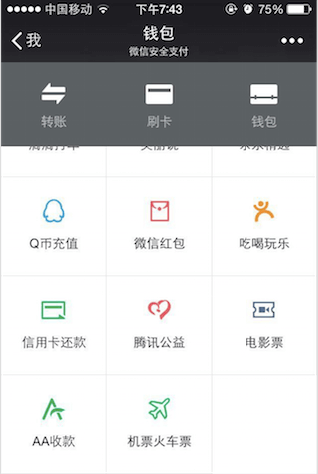
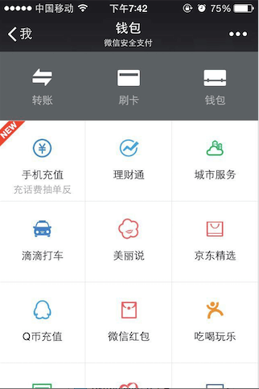
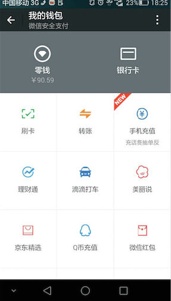
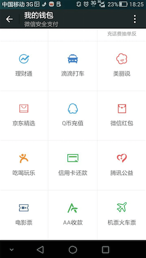
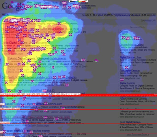

## 1. 先看看升级前[6.1]和升级后[6.2]的区别

**升级前：6.1** 

**升级后： 6.2** 

## 2. 我对这次升级的第一印象   

　　微信这次升级应该有不少改善的地方，我就 "钱包" 这个比较让我满意的功能点来谈谈我的感想。当时我打开钱包这个功能的时候，第一反应是 “wow，实在太赞了，终于把 “零钱” 这个按钮放出来了“。先说说我为什么喜欢零钱这个按钮，因为红包，常常抢红包，没几天我就会很好奇地去看看自己现在抢红包抢了多少钱，于是乎每次都要操作好几次：我 -> 钱包 -> 钱包 -> 零钱。而现在我只需要操作两次：我 -> 钱包 就可以看见我的零钱有多少了。一下子节省了两步，可能你会觉得这没什么稀奇的。可是我想说，对我这种经常使用这个功能来说的人，两步已经足够让我们惊喜了。   

　　好了，相信不少人看到我上面的说法，大都想说，众口难调，也许这个功能的升级只是让少部分我这种类型的用户满意而已，也许很多不想把 “零钱” 这个功能暴露出来的用户会吐槽这个改善点。yes，我相信是会有吐槽的用户。但是，我相信每一次升级，都肯定是经过深思熟虑的，肯定是经过验证的。这里就引出了一个很有趣的问题，在没有升级这个功能之前，微信产品组是基于什么来决定要改善这样一个功能的，是经过什么东西来验证这个功能的升级是有必要的？这个问题，也是我通过微信这次升级获得的思考和感悟----如何决定一个功能是否要改善？如何来预测用户的需求，或者说如何来预测用户对功能升级的反馈？   

　　好的，让我们先把问题强调一下，因为最后还要梳理方案呢。   

***问题 1. 如何决定一个功能是否需要改善？***  
***问题 2. 如何来预测用户的需求，或者说如何来预测用户对功能升级的反馈？***   

## 3. 如何决定一个功能是否需要改善   

　　其实，在感谢这次升级之余，我想过一个问题：我假设有很多用户向我一样，也很喜欢 ”零钱“ 这个功能的改善。但我确实很好奇，微信是怎么决定来要改善 ”零钱“ 这个功能的？作为一个做技术出生的，我从技术角度想了想，发现这个问题其实做起来，那是easy enough的，而且是完全可以量化的。

　　在[《参与感》](http://book.douban.com/subject/25942507/) 这本书中提到小米最初是如何呵护前几百个粉丝的，如何通过与粉丝的互动来改善小米的功能的。我想，一个反馈很好的功能升级，必然是在某种程度上与用户有所互动后的决定，或者说是在与用户 ”沟通” 后的决议。当然微信用户这么大，不可能向小米当初初创的时候一样，维护一个用户bbs来讨论用户的观点。必须要用一种更精准，更可以量化，可以解释，而且成本低廉的方法来做到与用户在功能点上的 “沟通”。   

　　好了，说了这么多废话，铺垫都全打好了，下面我就直接来说说在我看来，微信是怎么做到与用户 ”沟通“，微信是怎么决定要升级 ”零钱“ 这个功能的吧？  

　　其实，all roads lead to Rome，“沟通”的初衷是为了知道用户的想法，but我们应该要知道，用户的表达自己的想法，很多时候并不是通过语言来表达呢【甚至很多人根本没法用语言表达，特别是我这种光长得帅但表达能力处于世界级 low 20%的人】，用户还有很多其他的方法来表达自己的想法，其中最真实，最可信，最可量化的就是用户的action，actions speak louder than words。所以，我们要想知道用户的想法，其实完全可以通过另一条道路，即去探索用户的action，而且这种方法对所有用户都适用，男女老少通吃啊。    

　　so，现在又来一个问题了，这里的用户的action，具体指的是什么呢？下面给大家一张图，只要做过SEO的，相信看见这张图就完全明白我接下来要说的了。    

***问题 3. 用户的action，具体指的是什么***

    

　　上面是一张google点击的热点图，颜色越深代表越受到用户的关注。   

　　google的这个热点分析做得比较复杂，我们就不深入了。接着说我对“用户的action”这个问题的看法。其实最简单，也是最可信的action就是用户的点击了。每一个click，都可以看作用户对每一个功能的关注度，只要时间长，用户样本多，那么这个数据就是可信的。通过用户的点击数据，针对于用户来说，我们可以知道用户最常用的是哪些功能；针对于产品来说，我们可以知道一个产品的新功能点在发布后一段时间内的点击率的变化过程和趋势。

　　好了，其实上面我堆砌了几打的措辞，就是为了突出上面这段话，就是为了引出我认为本文的核心词---用户的点击数据。    

　　下面，我想梳理一下我的思路，以对上面提出的三个问题作答的形式来表明我的观点。   

## 4. The kernel behind my mind  

***问题 3. 用户的action，具体指的是什么***

    用户的action，简单的是指用户的点击数据；复杂的是指用户在每一个功能页面的停留时间。
    至于怎么处理分析这些数据，方法就太多了。   

***问题 2. 如何来预测用户的需求，或者说如何来预测用户对功能升级的反馈？***  

    可以根据用户对APP上每一个功能点的点击数据来做统计分析。功能点的划分可以有不同的维度，
    比如说微信6.1的钱包是可以是一个功能点，钱包里的零钱也可以作为一个功能点。也就是说，
    我们可以以不同的维度和粒度来区分功能点，对每一个功能点来做用户点击数据的统计分析。

***问题 1. 如何决定一个功能是否需要改善？***  

    有了上面的各个功能点的统计数据，我想大概就能决定一个功能点是否有必要更改了。
    当然，这只是其中一个因素，一个功能点的改善肯定不仅仅靠数据来决定的，
    也要看这个逻辑是否合理。比如说微信6.1的钱包，我要想看我自己的零钱的话，
    步骤是： 我 -> 钱包 -> 钱包 -> 零钱，我会觉得很奇怪，为什么会有两个“钱包”的功能，
    这在功能点上不是重复了吗？
    如果说升级成6.2的钱包的花，操作步骤是：我 -> 钱包，
    第一，去重了“钱包”这个重复的功能点，
    第二，不用点击零钱即可预先知道自己的零钱余额有多少。
    当然，这个细节还有很多可以提的，大家可以自行发挥想象和交流。

## 5. 如何做到真正的参与感   

　　所有的产品，都是服务于用户。熟话说得好，不以恋爱为目的的约会都是瞎折腾，不以用户为女神的产品都是瞎糊弄。既然产品的核心是用户，那我们关于产品所做的一切设计，优化甚至是改变都应该在改动之前与用户有过沟通，要确保用户对我们所做的改动有所认同。   

　　我很赞成小米初期的那种做法，维护一个简单的bbs，每天和粉丝们互动，收集需求，整理需求，规划产品，step by step地做到今天这个样子，值得借鉴和思考，但不可照搬。其一，因为人家的那种粉丝和其他很多产品的粉丝都不一样，人家的那种粉丝还有另外一个称呼 ”发烧友“，这些粉丝是有足够的耐心和愿意花足够的时间来反馈产品的优缺点和各自需求的。其二，当一个产品的用户数大了后，维护这个bbs将会话费大量人力物力，性价比太低。   

　　既然如此，既要和用户沟通，又要保证沟通成本，采用上面说的技术方案岂不是一个很不错的方法。而且上面说的技术方案，实现起来足够简单，而且可量化，可解释，甚至可跟踪。   

## 6. 最后，我想说

　　最后，我想说，以上所有，都只是自己对微信这次升级中，钱包功能的一个简单看法。小生是后端工程师一枚，不是的产品经理，只是简单的出于对这次升级的感谢，以及对产品的一点技术方面的简单思考而写的这篇文章。bug肯定很多，不过我享受调bug这个过程啊，哈哈。

## 扫一扫     

