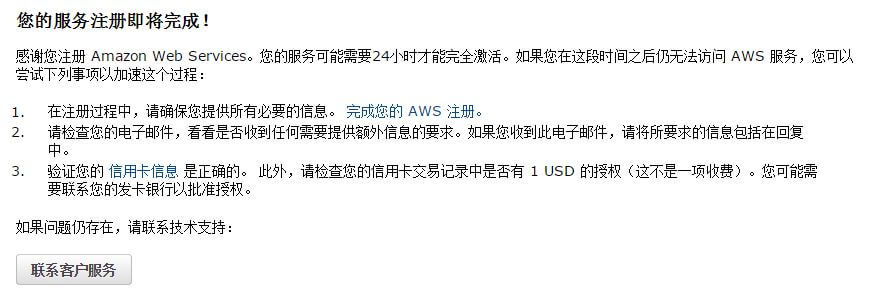

---
category: spark
published: false
layout: post
title: ［touch spark］2. Amazon AWS EC2 入门
description: 准备在AWS上跑spark的看过来了~~~
---  

##  
## 1. 申请Amazon AWS账号   
　　申请Amazon AWS需要绑定信用卡，无奈兄弟我从来没用过信用卡，所以只能跑到[global cash](https://www.globalcash.hk/)申请一张虚拟信用卡了。有关申请虚拟信用卡的教程[这里](http://www.freehao123.com/globalcash/)已经有了，我就不重复了。   
　　需要注意的是，申请好AWS账号后，会需要一段时间验证，一般一天之内就可以正常使用了。在此期间可以做一些基本的设置，比如说设置安全证书。未完成验证之前使用一些组件，比如说EC2，S3等时会出现下面这样子的提示。如果出现这样子的提示，可以先看看文档，到处随便逛逛，等验证好了就可以用了。   

  


## 2. 在EC2上创建一个spark集群  
### 2.1 前期准备  
　　本文中用到的所有脚本都是基于python 2.x写的，且在Linux和0S X上测试通过。  

### 2.2 创建AWS IAM，安全证书 
　　首先确保你的地区是US EAST，在右上角可以选择区域，即帐号名右侧。还没找到的请看下图：  
  

　　然后在帐号名->Security Credentials->Dashboard 下的 Details->Security Status->Manage Security Credentials->Access Keys->Create New Access Key创建keys，这里最好把keys记录下来，以后好用。    
　　在与 AWS 交互时，使用 AWS 安全证书验证您的身份以及您是否有权访问请求的资源。换句话说，安全证书可用于验证和授权对 AWS 的调用。关于安全证书更多的讲解，可以参考[这篇文档](http://docs.aws.amazon.com/zh_cn/general/latest/gr/aws-security-credentials.html)。    
　　设置变量，下面的KEY_ID, ACCESS_KEY是在你创建keys的时候产生的：

```  
export AWS_ACCESS_KEY_ID=<ACCESS_KEY_ID>
export AWS_SECRET_ACCESS_KEY=<SECRET_ACCESS_KEY>
```  


### 2.3 创建key pair  
　　在EC2 Dashboard左侧边栏->Network & Security->Key Pairs->Create Key Pair。这里会需要你输入一个key pair name，最好搞一个简单好记的，因为以后也会用到。创建成功后会自动下载一个用于后期验证登录的文件，下载该文件把其复制到用户家目录下，确保其权限至少是600，保险起见执行 chmod 600 key_pair_file。  

### 2.4 下载启动脚本  
```  
git clone git://github.com/amplab/ampcamp.git  
```  

### 2.5 建立并启动集群  
　　若上面的启动脚本下载成功后，本地会有一个ampcamp的文件夹，cd 到ampcamp文件夹里，执行下面命令启动集群。其中key_file是刚刚下载并复制到家目录下的验证文件，name_of_key_pair是你创建key_pair的时候自己命名的。  

``` 
./spark-ec2 -i <key_file> -k <name_of_key_pair> --copy launch ampcamp
``` 

　　上面这个过程大约会持续15-20分钟，耐心等待一下。如果期间出现下面这个问题，那是因为没有把key_pair文件复制到家目录下去。

```
rsync: connection unexpectedly closed (0 bytes received so far) [sender]
rsync error: unexplained error (code 255) at io.c(605) [sender=3.0.9]
Traceback (most recent call last):
  File "./spark_ec2.py", line 759, in <module>
    main()
  File "./spark_ec2.py", line 648, in main
    setup_cluster(conn, master_nodes, slave_nodes, zoo_nodes, opts, True)
  File "./spark_ec2.py", line 363, in setup_cluster
    deploy_files(conn, "deploy.generic", opts, master_nodes, slave_nodes, zoo_nodes)
  File "./spark_ec2.py", line 604, in deploy_files
    subprocess.check_call(command, shell=True)
  File "/root/anaconda/lib/python2.7/subprocess.py", line 540, in check_call
    raise CalledProcessError(retcode, cmd)
subprocess.CalledProcessError: Command 'rsync -rv -e 'ssh -o StrictHostKeyChecking=no -i ../company.pem' '/tmp/tmp6YpLzV/' 'root@ec2-54-172-219-206.compute-1.amazonaws.com:/'' returned non-zero exit status 255
root@ubuntu2:~/Desktop/spark/ampcamp# cp ../company.pem .
```  

　　如果一切顺利（但愿），最后会有消息提示创建成功：SUCCESS: Cluster successfully launched! You can login to the master at ***


### 2.6 其他相关命令    
　　第一个命令获取ampcamp集群的master节点，这个需要在集群启动成功后执行一次，因为后续也要用到这个节点地址，所以最好把master 节点地址记录下来。第二个命令是删除集群。    

```  
./spark-ec2 -i <key_file> -k <key_pair> get-master ampcamp   
./spark-ec2 -i <key_file> -k <key_pair> destroy ampcamp  
```  

## 3. 查看集群设置和数据准备

### 3.1 获取master节点地址  
　　在这个练习中，我们会用从[http://aws.amazon.com/datasets/4182](http://aws.amazon.com/datasets/4182)拿到的wikipedia的流量数据来做分析。  
　　方便起见，AMP Camp已经提前把(May 5 to May 7, 2009; roughly 20G and 329 million entries)的数据准备好，并且预加载到集群里一个HDFS机器上了。这样我们就不用准备数据了，可以专注在体验spark特性的这件事上。

### 3.1 获取master节点地址  

```  
./spark-ec2 -i <key_file> -k <key_pair> get-master ampcamp  
```  

　　此时成功的话应该会提示你当前有一个master，3个slave，0个ZooKeeper。  

### 3.2 使用ssh登录master节点  

```  
ssh -i <key_file> -l root <master_node_hostname>
or
ssh -i <key_file> root <master_node_hostname>
```  
　　需要注意的是，这里虽然你是登录到一个机器上，但实际是一个集群中。集群里有一个master节点，3个slave节点。其中你登录的地方是master节点，master节点主要负责任务分配和管理HDFS的元数据。其他的3个slave节点是计算节点，也就是真正运行任务的节点。  
　　在master里，执行ls可以看到以下几个文件夹，下面列出比较重要的几个文件夹：  

- ephemeral-hdfs: Hadoop installation  
- hive: Hive installation  
- java-app-template: Some stand-alone Spark programs in java  
- mesos: Mesos installation  
- mesos-ec2: A suite of scripts to manage Mesos on EC2  
- scala-2.9.1.final: Scala installation  
- scala-app-template: Some stand-alone Spark programs in scala  
- spark: Spark installation  
- shark: Shark installation  

　　可以在mesos-ec2/slaves文件里看到自己的3个slave节点地址：  

```
[root@ip-172-31-22-240 ~]# cat mesos-ec2/slaves
ec2-54-174-175-127.compute-1.amazonaws.com
ec2-54-174-183-88.compute-1.amazonaws.com
ec2-54-174-124-52.compute-1.amazonaws.com
```

　　你的HDFS集群应该已经提前载入20GB的wikipedia数据文件了，可以到ephemeral-hdfs/bin/下执行hadoop fs -ls /wiki/pagecounts查看，这里应该是有74个文件，其中2个是空的。其中每一个文件是以小时为单位来保存的。  

```  
[root@ip-172-31-22-240 ~]# ephemeral-hdfs/bin/hadoop fs -ls /wiki/pagecounts
Found 74 items
-rw-r--r--   3 root supergroup          0 2014-12-03 02:18 /wiki/pagecounts/part-00095
-rw-r--r--   3 root supergroup  244236879 2014-12-03 02:18 /wiki/pagecounts/part-00096
-rw-r--r--   3 root supergroup  233905016 2014-12-03 02:18 /wiki/pagecounts/part-00097
-rw-r--r--   3 root supergroup  225825888 2014-12-03 02:19 /wiki/pagecounts/part-00098
-rw-r--r--   3 root supergroup  225164279 2014-12-03 02:18 /wiki/pagecounts/part-00099
-rw-r--r--   3 root supergroup  228145848 2014-12-03 02:19 /wiki/pagecounts/part-00100
.            
.
.
-rw-r--r--   3 root supergroup  327382691 2014-12-03 02:26 /wiki/pagecounts/part-00163
-rw-r--r--   3 root supergroup  325471268 2014-12-03 02:27 /wiki/pagecounts/part-00164
-rw-r--r--   3 root supergroup  288288841 2014-12-03 02:27 /wiki/pagecounts/part-00165
-rw-r--r--   3 root supergroup  266179174 2014-12-03 02:29 /wiki/pagecounts/part-00166
-rw-r--r--   3 root supergroup  243451716 2014-12-03 02:18 /wiki/pagecounts/part-00167
-rw-r--r--   3 root supergroup          0 2014-12-03 02:19 /wiki/pagecounts/part-00168
```  

　　其中，每个文件都以一行为单位记录，每行都符合模式：`<date_time> <project_code> <page_title> <num_hits> <page_size>`。其中`<date_time>`字段以YYYYMMDD-HHMMSS为时间格式，表示访问时间，且以小时为单位，所以只有YYYYMMDD-HH为有效数据，MMSS都为0，`<project_code>`字段表示对应的页面所使用的语言，如"en"则表示英文；`<page_title>`字段表示该页面在wiki上的标题，`<num_hits>`表示从`<date_time>`时间起一小时内的浏览量，`<page_size>`表示以字节为单位，这个页面的大小。

```  
20090507-040000 aa Main_Page 7 51309
20090507-040000 aa Special:Boardvote 1 11631
20090507-040000 aa Special:Imagelist 1 931
```

　　下一篇会记录在EC2上用spark分析wikipedia流量的过程，请移步[使用Spark分析wikipedia流量数据](../using-amazon-aws-2)


## 相关资料   

- [AWS官方中文文档](http://docs.aws.amazon.com/zh_cn/general/latest/gr/Welcome.html)


## 扫一扫     

