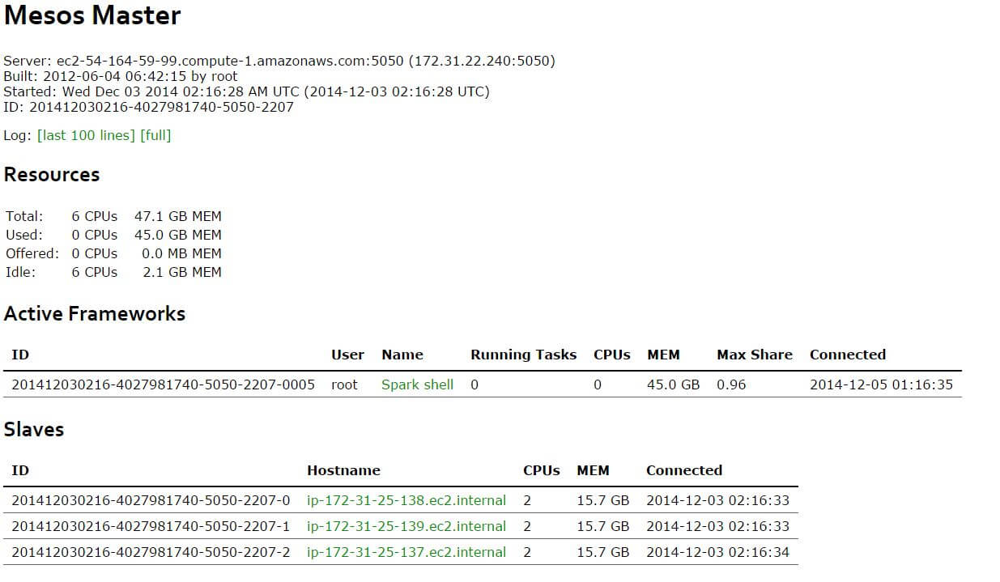
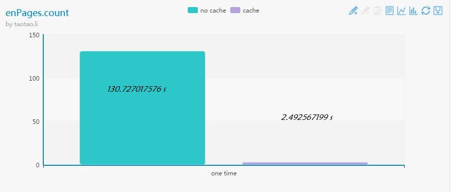

---
category: spark
published: false
layout: post
title: ［touch spark］3. 使用Spark分析wikipedia流量数据
description: 哇，spark还真不是盖的~~~
---  


　　本文是接上一篇的，所以序号就延续下来了。上一篇主要记录一些EC2配置和启动的问题，有兴趣请移步[Amazon AWS EC2 入门](../using-amazon-aws-1)


## 
##  
## 4. 利用spark来分析wikipedia流量数据  
　　启动spark shell。路径在/root/spark/spark-shell。

### 4.1  热身  
　　创建一个RDD，在spark-shell中，可以用sc代替SparkContext来创建RDD。这里需要注意一点，在Scala中有两种变量类型var和val，其中var是variable的缩写，val是value的缩写。顾名思义，var是可变的，val是不可变的。简单的可以把val理解成C/C++里的常量，或者Erlang里的变量【Erlang里的变量具有单次赋值的特征】。  

``` 
scala> var a ="aaa"
a: java.lang.String = aaa

scala> a = "a"
a: java.lang.String = a

scala> val b = "aaa"
b: java.lang.String = aaa

scala> b = "a"
<console>:12: error: reassignment to val
       b = "a"
         ^
```  

　　这里我们需要用val来指定一个新建的RDD，原因有2：第一，我们不需要对RDD做in place的改变，所以可以采用val来指定；其次，我们不应该对RDD做in place的改变，所以必须采用val来指定。下面，我们新建一个val型pagecounts变量，读取wikipedia 20GB的流量数据，并以两种方式打印前3条数据。  

``` 
scala> val pagecounts = sc.textFile("/wiki/pagecounts")
14/12/04 05:58:35 INFO mapred.FileInputFormat: Total input paths to process : 74
pagecounts: spark.RDD[String] = spark.MappedRDD@2fddef87

scala> pagecounts.take(3)
14/12/04 05:58:49 INFO spark.SparkContext: Starting job...
14/12/04 05:58:49 INFO spark.CacheTracker: Registering RDD ID 1 with cache
14/12/04 05:58:49 INFO spark.CacheTrackerActor: Registering RDD 1 with 177 partitions
14/12/04 05:58:49 INFO spark.CacheTracker: Registering RDD ID 0 with cache
14/12/04 05:58:49 INFO spark.CacheTrackerActor: Registering RDD 0 with 177 partitions
14/12/04 05:58:49 INFO spark.CacheTrackerActor: Asked for current cache locations
14/12/04 05:58:49 INFO spark.MesosScheduler: Final stage: Stage 0
14/12/04 05:58:49 INFO spark.MesosScheduler: Parents of final stage: List()
14/12/04 05:58:49 INFO spark.MesosScheduler: Missing parents: List()
14/12/04 05:58:49 INFO spark.MesosScheduler: Computing the requested partition locally
14/12/04 05:58:49 INFO spark.SparkContext: Job finished in 0.098193078 s
14/12/04 05:58:49 INFO spark.SparkContext: Starting job...
14/12/04 05:58:49 INFO spark.CacheTrackerActor: Asked for current cache locations
14/12/04 05:58:49 INFO spark.MesosScheduler: Final stage: Stage 1
14/12/04 05:58:49 INFO spark.MesosScheduler: Parents of final stage: List()
14/12/04 05:58:49 INFO spark.MesosScheduler: Missing parents: List()
14/12/04 05:58:49 INFO spark.MesosScheduler: Computing the requested partition locally
14/12/04 05:58:49 INFO spark.SparkContext: Job finished in 0.026119526 s
res1: Array[String] = Array(20090505-000000 aa.b ?71G4Bo1cAdWyg 1 14463, 20090505-000000 aa.b Special:Statistics 1 840, 20090505-000000 aa.b Special:Whatlinkshere/MediaWiki:Returnto 1 1019)

scala> pagecounts.take(3).foreach(println)
14/12/04 05:59:16 INFO spark.SparkContext: Starting job...
14/12/04 05:59:16 INFO spark.CacheTrackerActor: Asked for current cache locations
14/12/04 05:59:16 INFO spark.MesosScheduler: Final stage: Stage 2
14/12/04 05:59:16 INFO spark.MesosScheduler: Parents of final stage: List()
14/12/04 05:59:16 INFO spark.MesosScheduler: Missing parents: List()
14/12/04 05:59:16 INFO spark.MesosScheduler: Computing the requested partition locally
14/12/04 05:59:16 INFO spark.SparkContext: Job finished in 0.004355182 s
14/12/04 05:59:16 INFO spark.SparkContext: Starting job...
14/12/04 05:59:16 INFO spark.CacheTrackerActor: Asked for current cache locations
14/12/04 05:59:16 INFO spark.MesosScheduler: Final stage: Stage 3
14/12/04 05:59:16 INFO spark.MesosScheduler: Parents of final stage: List()
14/12/04 05:59:16 INFO spark.MesosScheduler: Missing parents: List()
14/12/04 05:59:16 INFO spark.MesosScheduler: Computing the requested partition locally
14/12/04 05:59:16 INFO spark.SparkContext: Job finished in 0.016392708 s
20090505-000000 aa.b ?71G4Bo1cAdWyg 1 14463
20090505-000000 aa.b Special:Statistics 1 840
20090505-000000 aa.b Special:Whatlinkshere/MediaWiki:Returnto 1 1019
```  

### 4.2 初试RDD Transfomation 和 RDD Action  
　　下面，我们来演示一个RDD Transformation的例子。关于RDD Transformation，这篇有详细介绍和示例[spark RDD transformation 学习](../spark-transformers/)。首先，我们先看看这20GB的文件里有多少条数据，然后查询一下看所有流量数据中，有多少条是浏览的英文wiki。  
　　首先，执行pagecounts.count来查看有多少条数据。这个动作会产生177个spark任务，这里是从HDFS读书数据，所以这个任务的瓶颈实在I/O这块，整个任务执行下来大概2~3分钟。这里我执行了几次，大概花了2分钟左右的时间，执行结果如下：  

```
scala> pagecounts.count
.
.
.
14/12/05 01:19:58 INFO spark.SimpleJob: Finished TID 173 (progress: 177/177)
14/12/05 01:19:58 INFO spark.MesosScheduler: Completed ResultTask(0, 174)
14/12/05 01:19:58 INFO spark.SparkContext: Job finished in 95.251659404 s
res0: Long = 329641466
```

　　在任务运行的时候，可以打开web窗口访问：http://<master_node_hostname>:8080 来实时观察执行进度。下面是我的一个截图示例：  
  

　　现在，我们来利用现在这个RDD来trasform出另外一个RDD，用于记录英文wiki的数据。也通过把英文wiki的流量数据写到内存里，来比较一下数据在内存中和不在内存中两种情况下一些操作的耗时。这个测试需要下面4步：  
　　1. 通过trasformation生成一个RDD[enPages]，记录英文wiki流量数据，因为这个步骤也需要遍历一边所有数据，所以这个步骤耗时也应该和上一个 pagecounts.count 耗时相当。

``` 
scala> val enPages = pagecounts.filter(_.split(" ")(1) == "en")
enPages: spark.RDD[String] = spark.FilteredRDD@1b8f2e35

scala> enPages.count
.
.
.
14/12/05 01:51:01 INFO spark.SparkContext: Job finished in 114.035390332 s
res1: Long = 122352588
```  

　　2. 把enPages缓存到内存中  

```  
scala> enPages.cache
res0: spark.RDD[String] = spark.FilteredRDD@78bf34f4
```  

　　3. 执行enPages.count，看看执行速度有神马区别，what happened? 按照原计划，现在不应该是神速吗？仔细看看下面的执行log，是不是有一种恍然大悟的赶脚啊？  

```  
scala> enPages.count
.
.
.
14/12/05 01:59:33 INFO spark.SimpleJob: Size of task 0:176 is 10680 bytes and took 4 ms to serialize by spark.JavaSerializerInstance
14/12/05 01:59:33 INFO spark.CacheTrackerActor: Cache entry added: (2, 176) on ip-172-31-25-137.ec2.internal (size added: 16.0B, available: 6.0GB)
14/12/05 01:59:33 INFO spark.SimpleJob: Finished TID 176 (progress: 172/177)
14/12/05 01:59:33 INFO spark.MesosScheduler: Completed ResultTask(0, 176)
14/12/05 01:59:34 INFO spark.CacheTrackerActor: Cache entry added: (2, 170) on ip-172-31-25-139.ec2.internal (size added: 10.3MB, available: 5.0GB)
14/12/05 01:59:34 INFO spark.SimpleJob: Finished TID 169 (progress: 173/177)
14/12/05 01:59:34 INFO spark.MesosScheduler: Completed ResultTask(0, 170)
14/12/05 01:59:35 INFO spark.CacheTrackerActor: Cache entry added: (2, 172) on ip-172-31-25-137.ec2.internal (size added: 183.3MB, available: 5.8GB)
14/12/05 01:59:35 INFO spark.SimpleJob: Finished TID 171 (progress: 174/177)
14/12/05 01:59:35 INFO spark.MesosScheduler: Completed ResultTask(0, 172)
14/12/05 01:59:35 INFO spark.CacheTrackerActor: Cache entry added: (2, 175) on ip-172-31-25-138.ec2.internal (size added: 16.0B, available: 6.1GB)
14/12/05 01:59:35 INFO spark.SimpleJob: Finished TID 174 (progress: 175/177)
14/12/05 01:59:35 INFO spark.MesosScheduler: Completed ResultTask(0, 175)
14/12/05 01:59:36 INFO spark.CacheTrackerActor: Cache entry added: (2, 173) on ip-172-31-25-138.ec2.internal (size added: 16.0B, available: 6.1GB)
14/12/05 01:59:36 INFO spark.SimpleJob: Finished TID 172 (progress: 176/177)
14/12/05 01:59:36 INFO spark.MesosScheduler: Completed ResultTask(0, 173)
14/12/05 01:59:36 INFO spark.CacheTrackerActor: Cache entry added: (2, 174) on ip-172-31-25-139.ec2.internal (size added: 178.3MB, available: 4.8GB)
14/12/05 01:59:36 INFO spark.SimpleJob: Finished TID 173 (progress: 177/177)
14/12/05 01:59:36 INFO spark.MesosScheduler: Completed ResultTask(0, 174)
14/12/05 01:59:36 INFO spark.SparkContext: Job finished in 130.727017576 s
res0: Long = 122352588
```

　　4. 好，现在我们再次执行enPages.count，看看是不是有神马神奇的事情发生了。  

```
scala> enPages.count
.
.
.
14/12/05 02:12:01 INFO spark.SparkContext: Job finished in 2.492567199 s
res2: Long = 122352588
```  
　　
　　哇，130秒和2.5秒的对决，心算一下，52倍啊，如果visualize一下这个数据，估计会更让人吃惊吧。擅于YY的我不禁用echarts画了个图，感受一下内存计算的神速。画图代码如下，直接把代码粘贴到[echarts bar](http://echarts.baidu.com/doc/example/bar1.html#macarons)，在再点击刷新就可以看到图了。 

``` 
option = {
    title : {
        text: 'enPages.count',
        subtext: 'by taotao.li'
    },
    tooltip : {
        trigger: 'axis'
    },
    legend: {
        data:['no cache','cache']
    },
    toolbox: {
        show : true,
        feature : {
            mark : {show: true},
            dataView : {show: true, readOnly: false},
            magicType : {show: true, type: ['line', 'bar']},
            restore : {show: true},
            saveAsImage : {show: true}
        }
    },
    calculable : true,
    xAxis : [
        {
            type : 'category',
            data : ['one time']
        }
    ],
    yAxis : [
        {
            type : 'value'
        }
    ],
    series : [
        {
            name:'no cache',
            type:'bar',
            data:[130.727017576]
        },
        {
            name:'cache',
            type:'bar',
            data:[2.492567199]
        }
    ]
};

```

  


### 4.3 分析wikipedia的每日PV  
　　重新温习一下[上一篇末尾](../using-amazon-aws-1)分析的wiki流量数据的格式如下：  

- date_time: 以YYYYMMDD-HHMMSS格式表示的访问时间，且以小时为单位；  
- project_code：表示对应的页面所使用的语言；  
- page_title：表示访问的wiki标题；  
- num_hits：表示从date_time起一小时内的浏览量；  
- page_size： 表示以字节为单位，这个页面的大小；  

　　OK，现在我们如果想要分析wiki流量的日PV，在上面5个字段中应该最关注的是date_time和num_hits吧。所以这里我们针对每一行数据创建一个key-value对，其中key是date_time，value是num_hits，在相加上相同的key对应的value就可以了。 下面我们把这些步骤拆开，一步一步分析，其中有些输出我就省略了。 

```
scala> val enTuples = enPages.map(line => line.split(" "))
enTuples: spark.RDD[Array[java.lang.String]] = spark.MappedRDD@34ba89c5

scala> enTuples.take(5)
.
.
.
14/12/08 03:05:26 INFO spark.SparkContext: Job finished in 7.956625757 s
res3: Array[Array[java.lang.String]] = Array(Array(20090505-000000, en, !, 4, 170494), Array(20090505-000000, en, !!!, 21, 306957), Array(20090505-000000, en, !!!Fuck_You!!!, 9, 87025), Array(20090505-000000, en, !!!Fuck_You!!!_And_Then_Some, 2, 18249), Array(20090505-000000, en, !!!Fuck_You!!!_and_Then_Some, 2, 17960))


scala> val enKeyValuePairs = enTuples.map(line => (line(0).substring(0, 8), line(3).toInt))
enKeyValuePairs: spark.RDD[(java.lang.String, Int)] = spark.MappedRDD@5e62a8d2

scala> enKeyValuePairs.take(5).foreach(println)
.
.
.
14/12/08 03:07:58 INFO spark.SparkContext: Job finished in 0.001414429 s
(20090505,4)
(20090505,21)
(20090505,9)
(20090505,2)
(20090505,2)

scala> val dailyPv = enKeyValuePairs.reduceByKey(_+_, 1)
dailyPv: spark.RDD[(java.lang.String, Int)] = spark.ShuffledRDD@50a934ec

scala> dailyPv.take(5).foreach(println)
.
.
.
14/12/08 03:13:18 INFO spark.SparkContext: Job finished in 26.776559986 s
(20090506,204190442)
(20090507,202617618)
(20090505,207698578)

scala> dailyPv.collect
.
.
.
14/12/08 03:13:45 INFO spark.SparkContext: Job finished in 0.145675681 s
res8: Array[(java.lang.String, Int)] = Array((20090506,204190442), (20090507,202617618), (20090505,207698578))
```

　　最后的collect方法会把RDD 转换成scala里的数组。take(n)方法是取出前n条，因为这里我们就分析3天的数据，所以最多也只能取钱3天的，这里take(5)是看看这样会不会有什么错误提示呢。  
　　上面我们大概用了3-4行语句来完成这个统计，这已经很强大了。而spark更强大的地方是它提供的编程模型，即transformation和action，虽然这些行为也就寥寥数十个，但已经足够处理大多数常见的问题了。比如说上面这个统计日PV的查询，在spark里其实完全可以把上面3-4行语句组合成一行语句，也就是说，在spark里，只有一行语句就可以统计当前wiki数据集下的日PV了。  

```
scala> enPages.map(line => line.split(" ")).map(line => (line(0).substring(0,8), line(3).toInt)).reduceByKey(_+_, 1).collect
.
.
.
14/12/08 03:25:03 INFO spark.SparkContext: Job finished in 27.144072883 s
res12: Array[(java.lang.String, Int)] = Array((20090506,204190442), (20090507,202617618), (20090505,207698578))
```
>
　　**可是老湿，你上面不是说只用一行语句就可以统计当前wiki数据集下的日PV的吗？可你这里用的是enPages啊！enPages不也是结果转换的吗，得把前几句加上吧？老湿，你骗我！！！**  
  
>
　　**同学，你问这个问题是不是刚才又写情书去了？既然enPages也是由其他RDD转换而来的，那这里不也可以把enPages替换成其他的RDD与与对应的transformation吗？**

  

```
scala> pagecounts.filter(_.split(" ")(1) == "en").map(line => line.split(" ")).map(line => (line(0).substring(0,8), line(3).toInt)).reduceByKey(_+_, 1).collect
 .
 .
 .
 14/12/08 04:33:52 INFO spark.SparkContext: Job finished in 151.78660518 s
res14: Array[(java.lang.String, Int)] = Array((20090506,204190442), (20090507,202617618), (20090505,207698578))
```

### 4.4 做点有趣的事情，看看哪些网页浏览次数最多  
　　OK，其实分析每日PV已经是一个很有用的分析案例了。特别是长时间段的，比如说一周，一月，一季等，这些数据会让公司在容灾容错方面有很大启发。同样有用的是分析热点数据，即哪些页面是用户最常访问的，这个在缓存系统建立方面是绝对的关键啊。想一想，要是你把一个用户很少访问的页面放到缓存系统里，是不是既浪费了昂贵的缓存空间，又费力不讨好，简直是事倍功半啊。所以，现在我们就来做一件事，根据wiki这几日的流量数据，分析一下用户最常访问的wiki页面。 

>
　　**要不，我们先预测一下。我个人觉得，怎么说至少也应该有主页，帮助页面吧。**

　　当然，首先还是需要继续温习一下数据流量的格式啊：

- date_time: 以YYYYMMDD-HHMMSS格式表示的访问时间，且以小时为单位；  
- project_code：表示对应的页面所使用的语言；  
- page_title：表示访问的wiki标题；  
- num_hits：表示从date_time起一小时内的浏览量；  
- page_size： 表示以字节为单位，这个页面的大小； 

　　既然我们要找到最常访问的热点数据，那就应该关注page_title和num_hits了。so，用分析日PV同样的思路，我们来分析一下热点数据：  

```
scala> enPages.take(5)
.
.
.
14/12/08 04:59:48 INFO spark.SparkContext: Job finished in 9.6166E-4 s
res15: Array[String] = Array(20090505-000000 en ! 4 170494, 20090505-000000 en !!! 21 306957, 20090505-000000 en !!!Fuck_You!!! 9 87025, 20090505-000000 en !!!Fuck_You!!!_And_Then_Some 2 18249, 20090505-000000 en !!!Fuck_You!!!_and_Then_Some 2 17960)

scala> val enPageArray = enPages.map( l=>l.split(" "))
enPageArray: spark.RDD[Array[java.lang.String]] = spark.MappedRDD@27174693

scala> enPageArray.take(5)
.
.
.
14/12/08 05:02:28 INFO spark.SparkContext: Job finished in 0.001180471 s
res16: Array[Array[java.lang.String]] = Array(Array(20090505-000000, en, !, 4, 170494), Array(20090505-000000, en, !!!, 21, 306957), Array(20090505-000000, en, !!!Fuck_You!!!, 9, 87025), Array(20090505-000000, en, !!!Fuck_You!!!_And_Then_Some, 2, 18249), Array(20090505-000000, en, !!!Fuck_You!!!_and_Then_Some, 2, 17960))

scala> val enPageKeyValue = enPageArray.map(l =>(l(2), l(3).toInt))
enPageKeyValue: spark.RDD[(java.lang.String, Int)] = spark.MappedRDD@5b68b32

scala> enPageKeyValue.take(5)
.
.
.
14/12/08 05:03:54 INFO spark.SparkContext: Job finished in 0.00113825 s
res17: Array[(java.lang.String, Int)] = Array((!,4), (!!!,21), (!!!Fuck_You!!!,9), (!!!Fuck_You!!!_And_Then_Some,2), (!!!Fuck_You!!!_and_Then_Some,2))

scala> val keyValueUnion = enPageKeyValue.reduceByKey(_+_, 40)
keyValueUnion: spark.RDD[(java.lang.String, Int)] = spark.ShuffledRDD@7843f53

scala> keyValueUnion.take(5).foreach(println)
.
.
.
14/12/08 05:17:35 INFO spark.SparkContext: Job finished in 98.416456363 s
(Einst%C3%83%C2%BCrzende_Neubauten,2)
(Maxemail,1)
(Michael_Carl,4)
(Boothe_Homestead,1)
(File:The_Photographer.jpg,20)

scala> val valueKey = keyValueUnion.map(x=>(x._2, x._1))
valueKey: spark.RDD[(Int, java.lang.String)] = spark.MappedRDD@47a82a6a

scala> valueKey.take(5).foreach(println)

14/12/08 05:19:42 INFO spark.SparkContext: Job finished in 4.196323691 s
(2,Einst%C3%83%C2%BCrzende_Neubauten)
(4,Michael_Carl)
(1,Maxemail)
(1,Boothe_Homestead)
(20,File:The_Photographer.jpg)

scala> valueKey.sortByKey(false).take(5).foreach(println)
.
.
.
14/12/08 05:21:59 INFO spark.SparkContext: Job finished in 41.025906283 s
(43822489,404_error/)
(18730347,Main_Page)
(17657352,Special:Search)
(5816953,Special:Random)
(3521336,Special:Randompage)
```

　　思路依然和分析每日PV是一样的，当然也可以组织成一行语句： 

```
val hotPage = enPages.map(l => l.split(" ")).map(l => (l(2), l(3).toInt)).reduceByKey(_+_, 40).map(x => (x._2, x._1)).sortByKey(false).take(10).foreach(println)
.
.
.
14/12/08 09:57:30 INFO spark.SparkContext: Job finished in 41.232081196 s
(43822489,404_error/)
(18730347,Main_Page)
(17657352,Special:Search)
(5816953,Special:Random)
(3521336,Special:Randompage)
(695817,Cinco_de_Mayo)
(534253,Swine_influenza)
(464935,Wiki)
(396776,Dom_DeLuise)
(382510,Deadpool_(comics))
```

　　好，这篇我们就先实践到这里。接下来体会一下shark的power，有兴趣的同志请移步[Spark Shark使用](../using-amazon-aws-3-shark)。


## 扫一扫     

