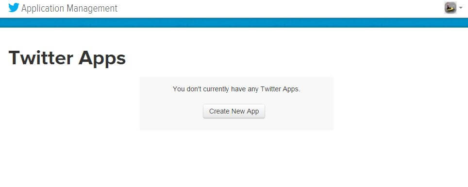
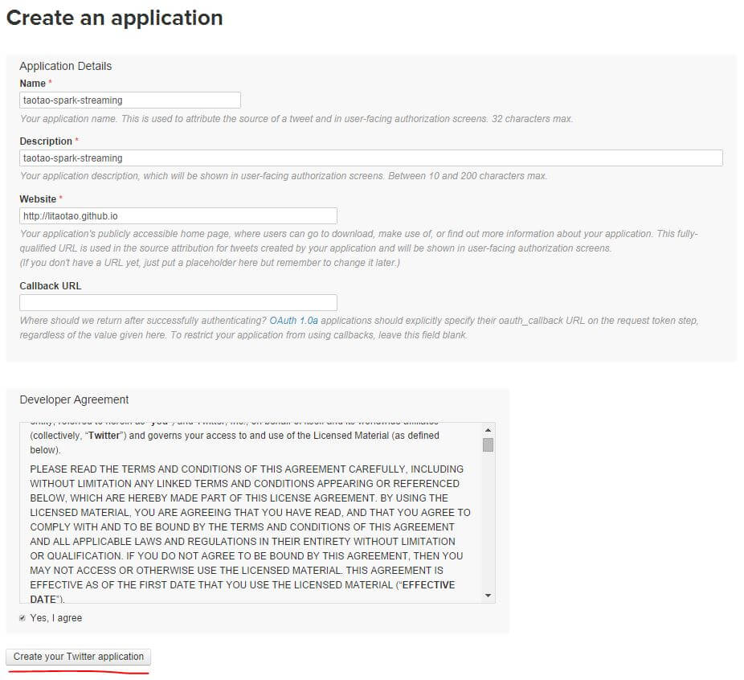

---
layout: post
published: false
title: ［touch spark］7. 终于等到你，spark streaming
description: 自从看到[databricks在spark summit 2014上的那个视频，我就一直想体会spark streaming的power，但心知万丈高楼平地起，所以一直默默地先打底层基础。昨晚为了多陪下老婆，就先没看了。现在有时间，终于可以体会到streaming的power了。现在，我觉得只有《终于等到你》这首歌的歌名能够表达我内心的激动了，我来了，streaming~~~
---  

##   
## 1. 写在前面  
　　我一直很佩服老外，佩服德国人的严谨，佩服美国人的创新。这次AMP实验室搞了个spark，你看人家产业链就快要出来了，从AMP的一个项目，到Apache的顶级项目，再到Databricks的成立。12年刚发表RDD那篇论文的哥们如今早已是Databricks的CTO了。看吧，其实国内很多人所谓的读书无用论其实作用域也就在国内成立吧。废话不多说，朋友们先看看databricks在2014 spark summit上的这个[演讲](http://v.youku.com/v_show/id_XNzQ1NDgxMzQ4.html)，看完你就知道神马叫牛逼，神马叫神速了。

## 2. 这次我想干嘛  
　　由于项目需要，boss让我调研一下spark。过了大概一两个星期吧，boss突然问我spark学得怎么样了。当时我心里的第一反应是：how to define the junior, middle and senior stage of learning spark ? 反正当时我的肯定也不算midlle和senior，可是junior的话又该怎么定义呢？wow，程序员思维害死人。懒得再纠结这些定义了，我直接给老板说还在起步阶段。boss说那你接着学吧。这还没完，我心里又想了，要是下次boss问我同样的问题该怎么回答呢，或者说，在我心中神马算junior，middle和junior呢？那时候我就想起databricks演讲里那个实时分析twitter的案例了。So amazing，我决定了，要是哪天我也能实现这样一个类似的例子，那我就算是junior入门了。我本身是有一点ML的经验的，看了一段时间的基础知识，现在终于可以实践streaming了，心里太激动了。想想过两天就能实现databricks那个案例了，oh my god，不禁感叹生活如此多娇。ok，spark streaming, here we go.  

## 3. 实时分析twitter数据    
### 3.1 事前准备  
　　这次我们来尝试下实时获取、分析twitter数据流。我们的项目大概由以下几个文件组成：  

- login.txt: 包含你的twitter用户名和密码   
- scala/sbt: 包含SBT工具的文件夹   
- scala/build.sbt: SBT项目信息文件    
- scala/Tutorial.scala: 项目主函数文件       
- scala/TutorialHelper.scala: 项目帮助函数文件

>
SBT: Simple Build Tool, 一个开源的用来构建scala或java项目的工具。当前，spark可以用sbt或maven来编译，但spark streaming 和shark只能用sbt来编译。

　　我们主要的工作是编写程序主文件 Tutorial.scala，这个文件应该像下面这样。

    import spark._
    import spark.streaming._
    import StreamingContext._
    import TutorialHelper._
    object Tutorial {
      def main(args: Array[String]) {
        // Location of the Spark directory
        val sparkHome = "/root/spark"

        // URL of the Spark cluster
        val sparkUrl = getSparkUrl()

        // Location of the required JAR files
        val jarFile = "target/scala-2.9.2/tutorial_2.9.2-0.1-SNAPSHOT.jar"

        // HDFS directory for checkpointing
        val checkpointDir = TutorialHelper.getHdfsUrl() + "/checkpoint/"

        // Twitter credentials from login.txt
        val (twitterUsername, twitterPassword) = getTwitterCredentials()

        // Your code goes here
      }
    }

### 3.2 twitter 授权配置     
- 使用你的twitter账号登陆这个 [twitter apps](https://apps.twitter.com/)，如果你从未创建过twitter app，那登陆上面这个链接后看起来应该是这样的：  
  
- 点击“Create a new application”按钮，合法填写相关字段，最后再点击“Create your Twitter application”，如果所填的字段合法，那现在就成功创建了一个 twitter app。如下图所示：  
  

### 3.3 牛刀小试  
　　我们先来看看一个简单的例子，什么都不做，就打印一些截取的实时twitter信息。  
　　为了实现实时流处理，spark提供了另外一种类型的RDD，叫StreamingContext，这里以后咱们再慢慢聊，其实就是一种特殊的RDD。接下来我们就先创建一个StreamingContext，然后你会发现，用一行语句就可以去拿twitter的实时信息流了。Amazing？Absolutely!当我第一次看到官方这个教程的时候，都不敢相信自己的眼睛，一共两行语句就搞定了。再次对AMP的那几个大师俯首称臣，太厉害了，人家把库都做好了，你直接拿来用就好了。  
　　这里插播一句，2013年11月27号，那天傍晚是我来面试公司，第一位面试官，也是力排众议把我招进来的CSO。当时他问我会不会hadoop，我说“不会，但是在学校听说过，听说搞这个东西很难的，我们公司也需要这个背景吗？”。他这下就惊奇了，并不是因为我说自己不会hadoop，而是因为我说这个东西很难。直接回答我说“难的东西作者们已经给咱们做过了，你直接拿来用就可以了！”这句话对我一直受用至今，工作这半年多来，我时常想起这句话，的确，难的事情别人已经几乎帮你解决了，大多数工作我们只是拿来主义，根本就没有资格、根本就不应该说难的。没想到当时只听过hadoop的我，现在spark都玩上了，哈哈，心里还是很爽。  

　　ok，废话不多说了，看看这两行语句是怎么写的吧：  

    val ssc = new StreamingContext(sparkUrl, "Tutorial", Seconds(1), sparkHome, Seq(jarFile))
    val tweets = ssc.twitterStream(twitterUsername, twitterPassword)    

　　sparkUrl, sparkHome, jarFile 都是之前初始化好的变量；"Tutorial"是一个标志这个应用的唯一应用名，在Spark Web UI里可以看到；Seconds(1)表示设置每个1秒取一次twitter信息。接着创建了一个tweets的变量，这是一个DStream类型。关于DStream，这里我们另启一篇文章来讲吧，有兴趣的话读完这篇文档就知道[DStream](http://spark.apache.org/docs/latest/streaming-programming-guide.html)的前世今生了。  

　　下面，我们打印一些信息来玩玩。和RDD transformation一样，map操作把每个status对象转变成其字符串形式，并构建一个新的DStream对象。而print操作并不是打印所有数据，默认是打印前十条记录。在咱们这个程序中，它打印每秒收到的前十条twitter信息。

    val statuses = tweets.map(status => status.getText())
    statuses.print()

　　然后我们把数据存储到本地磁盘上，这下整个程序看起来应该是这个样子的了：  

    import spark._
    import spark.streaming._
    import StreamingContext._
    import TutorialHelper._
    object Tutorial {
      def main(args: Array[String]) {
        // Location of the Spark directory
        val sparkHome = "/root/spark"
        
        // URL of the Spark cluster
        val sparkUrl = getSparkUrl()
        
        // Location of the required JAR files
        val jarFile = "target/scala-2.9.2/tutorial_2.9.2-0.1-SNAPSHOT.jar"
        
        // HDFS directory for checkpointing
        val checkpointDir = TutorialHelper.getHdfsUrl() + "/checkpoint/"
        
        // Twitter credentials from login.txt
        val (twitterUsername, twitterPassword) = getTwitterCredentials()
        
        // Your code goes here
        val ssc = new StreamingContext(sparkUrl, "Tutorial", Seconds(1), sparkHome, Seq(jarFile))
        val tweets = ssc.twitterStream(twitterUsername, twitterPassword)  
        val statuses = tweets.map(status => status.getText())
        statuses.print() 
        ssc.checkpoint(checkpointDir) 
        ssc.start()
      }
    }

## 扫一扫     

