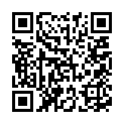

---
category: spark
published: false
layout: post
title: ［touch spark］6. 使用Spark分析来做一些机器学习的事情
description: 哇，初步体验BDAS---the Berkeley Data Analytics Stack
---  

##   
## 1. 写在前面  
　　BDAS---the Berkeley Data Analytics Stack，不得不说，老美真的好厉害，一下子就呼出个BDAS，霸气外漏啊，不过人家有底气啊，没办法，有才就是任性。这次初步通过一个机器学习的例子再来体会一下spark。

## 2. 这次准备干嘛  
　　我们这次用spark来做一个电影推荐的练习。这次用到的数据包含从72,000个用户对10,000部电影进行1000万次评分情况。实验中用到的所有数据会在最后列出下载链接。  

## 3. 数据集结构    
　　我们用到ratings.dat和movies.dat数据文件。其中ratings和movies结构如下：

	UserID::MovieID::Rating::Timestamp
	MovieID::Title::Genres

## 扫一扫     

