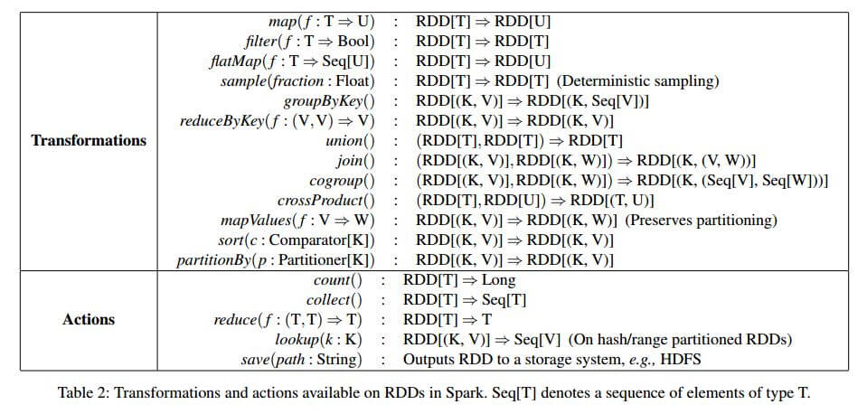

---
category: spark
published: false
layout: post
title: ［touch spark］5. spark RDD 之：RDD Transformation
description: 总结spark transformation，了解spark编程内涵～～～	
---  

##  
## 1. 什么是RDD 
　　关于什么是RDD，可以参考上一篇 [4. spark RDD 之：什么是RDD](../spark-what-is-rdd)

## 2. RDD transfomation 一览  
　　ok，了解了RDD的含义，我们可以来看看神马叫transformation了，中文叫转换。上一篇提到RDD可以由两种方式创建，而在实际应用中，一般第一种方式都是用于新建一个RDD的时候，大多数时候都是通过第二种方式来生成一个新的RDD。so，想想这里我们应该怎么来根据一个已存在的RDD来transform出另一个新的RDD呢？当然就是根据一些规则，比如说筛选，映射，分组等等，而用于支撑这些规则的函数，就叫做RDD的transformation。  
　　下面我们通过下面这张表来看看RDD都支持哪些规则的transformation吧。 这些是[官方](http://spark.apache.org/docs/latest/programming-guide.html#transformations)列出的一些常用的transformation，我原本想把所有transformation列出来的，可考虑到2/8原则，想想下面这些在实际应用中应该足够了。如果真的需要其他transformation的时候，相比彼时你的功力应该已到阅读、贡献源码的级别了。也就不需要再参考我下面将要写的东西了。   
　　这些transformation中有一些是我不太熟悉的，所以这里记录一下我不太熟悉的那些转换函数的用法，仅供个人参考哦。

| No | Transformation  |  Meaning | 
|---|---|---|
| 1 | map(func) | Return a new distributed dataset formed by passing each element of the source through a function func.  | 
| 2 | filter(func) | Return a new dataset formed by selecting those elements of the source on which func returns true. |
| 3 | flatMap(func) | Similar to map, but each input item can be mapped to 0 or more output items (so func should return a Seq rather than a single item). |
| 4 | mapPartitions(func) | Similar to map, but runs separately on each partition (block) of the RDD, so func must be of type Iterator<T> => Iterator<U> when running on an RDD of type T. |
| 5 | mapPartitionsWithIndex(func) | Similar to mapPartitions, but also provides func with an integer value representing the index of the partition, so func must be of type (Int, Iterator<T>) => Iterator<U> when running on an RDD of type T. |
| 6 | sample(withReplacement, fraction, seed) | Sample a fraction fraction of the data, with or without replacement, using a given random number generator seed. |
| 7 | union(otherDataset) | Return a new dataset that contains the union of the elements in the source dataset and the argument. |
| 8 | intersection(otherDataset) | Return a new RDD that contains the intersection of elements in the source dataset and the argument. |
| 9 | distinct([numTasks])) | Return a new dataset that contains the distinct elements of the source dataset. |
| 10 | groupByKey([numTasks]) | When called on a dataset of (K, V) pairs, returns a dataset of (K, Iterable<V>) pairs.   |
| 11 | reduceByKey(func, [numTasks]) | When called on a dataset of (K, V) pairs, returns a dataset of (K, V) pairs where the values for each key are aggregated using the given reduce function func, which must be of type (V,V) => V. Like in groupByKey, the number of reduce tasks is configurable through an optional second argument. |
| 12 | aggregateByKey(zeroValue)(seqOp, combOp, [numTasks]) | When called on a dataset of (K, V) pairs, returns a dataset of (K, U) pairs where the values for each key are aggregated using the given combine functions and a neutral "zero" value. Allows an aggregated value type that is different than the input value type, while avoiding unnecessary allocations. Like in groupByKey, the number of reduce tasks is configurable through an optional second argument. |
| 13 | sortByKey([ascending], [numTasks]) | When called on a dataset of (K, V) pairs where K implements Ordered, returns a dataset of (K, V) pairs sorted by keys in ascending or descending order, as specified in the boolean ascending argument. |
| 14 | join(otherDataset, [numTasks]) | When called on datasets of type (K, V) and (K, W), returns a dataset of (K, (V, W)) pairs with all pairs of elements for each key. Outer joins are also supported through leftOuterJoin and rightOuterJoin. |

## 3. RDD transfomation  
　　RDD 的transformation有几个和scala里的函数组合子一样，其他的我估计也是基于scala的组合子来写的。所以，为了方便起见，能用scala来展现的，我就用scala来写；不可以的，我再用spark来写示例。下面提到的transformation更新到[spark 1.1.1版本](http://spark.apache.org/docs/latest/programming-guide.html#transformations)。要想查看最新版本的，可以上[官网](http://spark.apache.org/)和[官方API文档](http://spark.apache.org/docs/latest/api/scala/index.html#org.apache.spark.rdd.RDD)。这里顺带提一下，说到transformation，网上几乎每篇说spark的文章都会用到下面这张图。可是我真的想说，这张图可是Matei这哥们2012年发的[RDD论文](https://www.cs.berkeley.edu/~matei/papers/2012/nsdi_spark.pdf)里的啊，spark更新的速度也许比大多数人换对象的速度还快啊，好多东西已经变了。大家以后要是发这张图，就该说明出处和版本吧，免得大家误解transformation和actions就那几种类型啊。  
　　以下都是基于官方[API DOC](http://spark.apache.org/docs/latest/api/scala/index.html#org.apache.spark.rdd.RDD)，在我本机上的测试以及网络资料整理而来。所有参考过的资料我都会在最后列出来，供参考。

## 3.1 RDD transfomation － flatMap  
　　说明：  
　　flatMap可以理解成map和flat的组合。他处理一个嵌套列表，对其中每个列表中的元素执行map，然后对每个列表执行flat，最后返回一个列表。   
　　所以，我们也可以先flatten一个列表，再对列表里的每个元素做mapping；当然也可以对嵌套列表里的每个元素做mapping，再对列表做flatten。看下面的例子就明白了：  

　　定义：  

    def
    flatMap[U](f: (T) ⇒ TraversableOnce[U])(implicit arg0: ClassTag[U]): RDD[U]
    Return a new RDD by first applying a function to all elements of this RDD, and then flattening the results.   

　　示例：  

    // flatMap operation
    scala> val test = List(List(1,2,3,4,5), List(10,20,30,40,50))
    test: List[List[Int]] = List(List(1, 2, 3, 4, 5), List(10, 20, 30, 40, 50))

    scala> val test1 = test.flatMap( x => x.map(_ * 2))
    test1: List[Int] = List(2, 4, 6, 8, 10, 20, 40, 60, 80, 100)

    // flat first, then mapping
    scala> val tset2 = test.flatten
    tset2: List[Int] = List(1, 2, 3, 4, 5, 10, 20, 30, 40, 50)

    scala> val test3 = test.flatten.map(_*2)
    test3: List[Int] = List(2, 4, 6, 8, 10, 20, 40, 60, 80, 100)

    // mapping first, then flat
    scala> val test4 = test.map( x => x.map(_*2))
    test4: List[List[Int]] = List(List(2, 4, 6, 8, 10), List(20, 40, 60, 80, 100))

    scala> val test5 = test.map(x => x.map(_*2)).flatten
    test5: List[Int] = List(2, 4, 6, 8, 10, 20, 40, 60, 80, 100)

## 3.2 RDD transfomation － mapPartitions  
　　说明：  
　　mapPartitions是map的一个变种。map的输入函数是应用于RDD中每个元素，而mapPartitions的输入函数是应用于每个分区，也就是把每个分区中的内容作为整体来处理的。 

　　定义：  

    def  
    mapPartitions[U](f: (Iterator[T]) ⇒ Iterator[U], preservesPartitioning: Boolean = false)(implicit arg0: ClassTag[U]): RDD[U]
    Return a new RDD by applying a function to each partition of this RDD.

    preservesPartitioning indicates whether the input function preserves the partitioner, which should be false unless this is a pair RDD and the input function doesn't modify the keys.

　　f即为输入函数，它处理每个分区里面的内容。每个分区中的内容将以Iterator[T]传递给输入函数f，f的输出结果是Iterator[U]。最终的RDD由所有分区经过输入函数处理后的结果合并起来的。

## 3.3 RDD transfomation － mapPartitionsWithIndex | mapPartitionsWithContext   
　　说明：   
　　mapPartitions还有些变种，比如mapPartitionsWithContext，它能把处理过程中的一些状态信息传递给用户指定的输入函数。还有mapPartitionsWithIndex，它能把分区的index传递给用户指定的输入函数。

　　定义： 

    def
    mapPartitionsWithContext[U](f: (TaskContext, Iterator[T]) ⇒ Iterator[U], preservesPartitioning: Boolean = false)(implicit arg0: ClassTag[U]): RDD[U]
    Return a new RDD by applying a function to each partition of this RDD. This is a variant of mapPartitions that also passes the TaskContext into the closure.

    preservesPartitioning indicates whether the input function preserves the partitioner, which should be false unless this is a pair RDD and the input function does not modify the keys.
    Annotations

    def
    mapPartitionsWithIndex[U](f: (Int, Iterator[T]) ⇒ Iterator[U], preservesPartitioning: Boolean = false)(implicit arg0: ClassTag[U]): RDD[U]
    Return a new RDD by applying a function to each partition of this RDD, while tracking the index of the original partition.

    preservesPartitioning indicates whether the input function preserves the partitioner, which should be false unless this is a pair RDD and the input function doesn't modify the keys.

## 3.3 RDD transfomation －  sample  
　　说明：   
　　根据fraction指定的比例，对数据进行采样，可以选择是否用随机数进行替换，seed用于指定随机数生成器种子。这里我一直有一个疑问，当我的数据集里有100个元素是，设置fraction为0.1，按理应该是返回10个随机数的，可是就返回了6个。似乎返回的随机数会少于数据集元素数量*随机数的比例，晚点继续研究。

　　定义： 

    def  sample(withReplacement: Boolean, fraction: Double, seed: Long = Utils.random.nextLong): RDD[T]
    Return a sampled subset of this RDD.  

　　示例：  

    scala> val a = sc.parallelize(1 to 100)
    a: org.apache.spark.rdd.RDD[Int] = ParallelCollectionRDD[17] at parallelize at <console>:12

    scala> val sample = a.sample(false, 0.1, 0)
    sample: org.apache.spark.rdd.RDD[Int] = PartitionwiseSampledRDD[18] at sample at <console>:14

    scala> sample.count
    .
    .
    .
    14/12/12 10:39:07 INFO TaskSchedulerImpl: Removed TaskSet 23.0, whose tasks have all completed, from pool 
    14/12/12 10:39:07 INFO SparkContext: Job finished: count at <console>:17, took 3.491275316 s
    res29: Long = 6

    scala> sample.collect
    .
    .
    .
    14/12/12 10:39:11 INFO DAGScheduler: Stage 24 (collect at <console>:17) finished in 0.142 s
    14/12/12 10:39:11 INFO SparkContext: Job finished: collect at <console>:17, took 0.151221638 s
    res30: Array[Int] = Array(22, 46, 48, 80, 87, 97)

　　后话：  
　　在看API DOC的时候发现有一个和sample很像的transformation，takeSample，但准确的说这并不是一个transformation，应该算是一个action吧。这个函数可以从数据集里返回固定数量的随机数，弥补上上面我提到的sample那个问题。但是需要注意的是，这个函数是直接在RDD上计算，返回计算结果，并不是一个transformation。看下面的例子就明白了。   

　　示例2：  

    scala> val takeSample = a.takeSample(false, 10, 0)
    .
    .
    .
    14/12/12 10:43:24 INFO DAGScheduler: Stage 26 (takeSample at <console>:14) finished in 0.068 s
    14/12/12 10:43:24 INFO SparkContext: Job finished: takeSample at <console>:14, took 0.074973222 s
    takeSample: Array[Int] = Array(68, 18, 97, 26, 61, 33, 67, 10, 2, 1)

    scala> takeSample
    res33: Array[Int] = Array(68, 18, 97, 26, 61, 33, 67, 10, 2, 1)

## 3.4 RDD transfomation － union  

　　说明：  
　　这个把两个RDD合并为一个，很简单，可以理解成计算并集。但值得说明的是，union和++运算符是等价的，至少在函数定义上是完全一致的。先了解下，以后有需要的时候再看是否有细节上的区别。  

　　定义：   

    def
    ++(other: RDD[T]): RDD[T]
    Return the union of this RDD and another one. Any identical elements will appear multiple times (use .distinct() to eliminate them).
    def
    union(other: RDD[T]): RDD[T]
    Return the union of this RDD and another one. Any identical elements will appear multiple times (use .distinct() to eliminate them).

　　示例：  
    scala> a
    res37: org.apache.spark.rdd.RDD[Int] = ParallelCollectionRDD[17] at parallelize at <console>:12

    scala> val a = sc.parallelize(1 to 10)
    a: org.apache.spark.rdd.RDD[Int] = ParallelCollectionRDD[20] at parallelize at <console>:12

    scala> val b = sc.parallelize(11 to 20)
    b: org.apache.spark.rdd.RDD[Int] = ParallelCollectionRDD[21] at parallelize at <console>:12

    scala> val c1 = a++b
    c1: org.apache.spark.rdd.RDD[Int] = UnionRDD[22] at $plus$plus at <console>:16

    scala> val c2 = a.union(b)

    scala> c1.collect
    .
    .
    .
    14/12/12 11:01:13 INFO SparkContext: Job finished: collect at <console>:19, took 0.3475174 s
    res38: Array[Int] = Array(1, 2, 3, 4, 5, 6, 7, 8, 9, 10, 11, 12, 13, 14, 15, 16, 17, 18, 19, 20)

    scala> c2.collect
    .
    .
    .
    14/12/12 11:01:17 INFO SparkContext: Job finished: collect at <console>:19, took 0.122094635 s
    res39: Array[Int] = Array(1, 2, 3, 4, 5, 6, 7, 8, 9, 10, 11, 12, 13, 14, 15, 16, 17, 18, 19, 20)

## 3.5 RDD transfomation － intersection    
  
　　说明：   
　　对比上面的union就很好理解了，上面是计算并集，这里是计算交集。这个transformation也有需要注意的地方，就是其有三种形式，根据是否提供第二个参数以及第二个参数的类型。具体可以参考函数定义。c++里这叫多态，现在对scala才是初学阶段，我想既然scala也是OO，那应该也有多态类似的概念吧，这里晚点继续补上。

　　定义：   

    def
    intersection(other: RDD[T], numPartitions: Int): RDD[T]
    Return the intersection of this RDD and another one. The output will not contain any duplicate elements, even if the input RDDs did. Performs a hash partition across the cluster

    Note that this method performs a shuffle internally.
    numPartitions
    How many partitions to use in the resulting RDD

    def
    intersection(other: RDD[T], partitioner: Partitioner)(implicit ord: Ordering[T] = null): RDD[T]
    Return the intersection of this RDD and another one. The output will not contain any duplicate elements, even if the input RDDs did.

    Note that this method performs a shuffle internally.
    partitioner
    Partitioner to use for the resulting RDD

    def
    intersection(other: RDD[T]): RDD[T]
    Return the intersection of this RDD and another one. The output will not contain any duplicate elements, even if the input RDDs did.

    Note that this method performs a shuffle internally.  

　　示例：   

    val x = sc.parallelize(1 to 20)
    val y = sc.parallelize(10 to 30)
    val z = x.intersection(y)

    z.collect
    res74: Array[Int] = Array(16, 12, 20, 13, 17, 14, 18, 10, 19, 15, 11)

## 3.6 RDD transfomation － distinct  
  
　　说明：   
　　即去重，相当于python里面的set。

　　定义：    

    def
    distinct(): RDD[T]
    Return a new RDD containing the distinct elements in this RDD.
    def
    distinct(numPartitions: Int)(implicit ord: Ordering[T] = null): RDD[T]
    Return a new RDD containing the distinct elements in this RDD.

## 3.7 RDD transfomation － groupByKey  
  
　　说明：   
　　这是一个针对键值对结构来进行操作的转换方法，即你的RDD的结构是(key, value)类型，而其中key不是唯一性的。此时我们可以对这个RDD进行groupByKey的转换得到新的RDD，新的RDD的结构同样也是键值对，只是值改变了，并且键是唯一性的，即(key, iterator(value))。

　　定义：   

    def
    groupByKey(): RDD[(K, Iterable[V])]
    Group the values for each key in the RDD into a single sequence. Hash-partitions the resulting RDD with the existing partitioner/parallelism level.

    Note: This operation may be very expensive. If you are grouping in order to perform an aggregation (such as a sum or average) over each key, using PairRDDFunctions.aggregateByKey or PairRDDFunctions.reduceByKey will provide much better performance.
    def
    groupByKey(numPartitions: Int): RDD[(K, Iterable[V])]
    Group the values for each key in the RDD into a single sequence. Hash-partitions the resulting RDD with into numPartitions partitions.

    Note: This operation may be very expensive. If you are grouping in order to perform an aggregation (such as a sum or average) over each key, using PairRDDFunctions.aggregateByKey or PairRDDFunctions.reduceByKey will provide much better performance.
    def
    groupByKey(partitioner: Partitioner): RDD[(K, Iterable[V])]
    Group the values for each key in the RDD into a single sequence. Allows controlling the partitioning of the resulting key-value pair RDD by passing a Partitioner.

    Note: This operation may be very expensive. If you are grouping in order to perform an aggregation (such as a sum or average) over each key, using PairRDDFunctions.aggregateByKey or PairRDDFunctions.reduceByKey will provide much better performance.

## 3.8 RDD transfomation － reduceByKey    
  
　　说明：    
　　和上面的groupByKey一样，这也是一个针对(key, value)型结构的RDD的转换函数。只是上面的groupByKey是将相同key对应的value组合成一个可迭代的对象；而reduceByKey是将相同key对应的value通过传入的函数func计算成一个新的value。

　　定义：     

    def
    reduceByKey(func: (V, V) ⇒ V): RDD[(K, V)]
    Merge the values for each key using an associative reduce function. This will also perform the merging locally on each mapper before sending results to a reducer, similarly to a "combiner" in MapReduce. Output will be hash-partitioned with the existing partitioner/ parallelism level.
    def
    reduceByKey(func: (V, V) ⇒ V, numPartitions: Int): RDD[(K, V)]
    Merge the values for each key using an associative reduce function. This will also perform the merging locally on each mapper before sending results to a reducer, similarly to a "combiner" in MapReduce. Output will be hash-partitioned with numPartitions partitions.
    def
    reduceByKey(partitioner: Partitioner, func: (V, V) ⇒ V): RDD[(K, V)]
    Merge the values for each key using an associative reduce function. This will also perform the merging locally on each mapper before sending results to a reducer, similarly to a "combiner" in MapReduce.

　　示例：　  

## 3.9 RDD transfomation － aggregateByKey  

　　说明：    

　　定义：  

    def
    aggregateByKey[U](zeroValue: U)(seqOp: (U, V) ⇒ U, combOp: (U, U) ⇒ U)(implicit arg0: ClassTag[U]): RDD[(K, U)]
    Aggregate the values of each key, using given combine functions and a neutral "zero value". This function can return a different result type, U, than the type of the values in this RDD, V. Thus, we need one operation for merging a V into a U and one operation for merging two U's, as in scala.TraversableOnce. The former operation is used for merging values within a partition, and the latter is used for merging values between partitions. To avoid memory allocation, both of these functions are allowed to modify and return their first argument instead of creating a new U.
    def
    aggregateByKey[U](zeroValue: U, numPartitions: Int)(seqOp: (U, V) ⇒ U, combOp: (U, U) ⇒ U)(implicit arg0: ClassTag[U]): RDD[(K, U)]
    Aggregate the values of each key, using given combine functions and a neutral "zero value". This function can return a different result type, U, than the type of the values in this RDD, V. Thus, we need one operation for merging a V into a U and one operation for merging two U's, as in scala.TraversableOnce. The former operation is used for merging values within a partition, and the latter is used for merging values between partitions. To avoid memory allocation, both of these functions are allowed to modify and return their first argument instead of creating a new U.
    def
    aggregateByKey[U](zeroValue: U, partitioner: Partitioner)(seqOp: (U, V) ⇒ U, combOp: (U, U) ⇒ U)(implicit arg0: ClassTag[U]): RDD[(K, U)]
    Aggregate the values of each key, using given combine functions and a neutral "zero value". This function can return a different result type, U, than the type of the values in this RDD, V. Thus, we need one operation for merging a V into a U and one operation for merging two U's, as in scala.TraversableOnce. The former operation is used for merging values within a partition, and the latter is used for merging values between partitions. To avoid memory allocation, both of these functions are allowed to modify and return their first argument instead of creating a new U.

　　示例：　  

## 3.10 RDD transfomation － sortByKey   

　　说明：    
　　按key来排序。但是在一些情况下，当RDD是(key, value)类型时，如果想对value来排序应该怎么处理呢？很简单，就是先把原来的(key, value)转换成(value, key)结构，然后对(value, key)进行sortByKey操作，最后再把已经排序了的(value, key)转换回(key, value)形式。

　　定义：     
　　奇怪了，我再官方API DOC里没有找到这个转换函数的定义，晚一点再看一下。

　　示例：　  

## 3.11 RDD transfomation － join  

　　说明：    
　　把两个(key, value)结构的RDD合成一个新的(key, value)结构的RDD。即(k1, v1).join((k1, v2)) => (k1, (v1, v2))，需要注意的是，为了让join操作成功，必须保证key是可以比较的。

　　定义：     

    def
    join[W](other: RDD[(K, W)], numPartitions: Int): RDD[(K, (V, W))]
    Return an RDD containing all pairs of elements with matching keys in this and other. Each pair of elements will be returned as a (k, (v1, v2)) tuple, where (k, v1) is in this and (k, v2) is in other. Performs a hash join across the cluster.
    def
    join[W](other: RDD[(K, W)]): RDD[(K, (V, W))]
    Return an RDD containing all pairs of elements with matching keys in this and other. Each pair of elements will be returned as a (k, (v1, v2)) tuple, where (k, v1) is in this and (k, v2) is in other. Performs a hash join across the cluster.
    def
    join[W](other: RDD[(K, W)], partitioner: Partitioner): RDD[(K, (V, W))]
    Return an RDD containing all pairs of elements with matching keys in this and other. Each pair of elements will be returned as a (k, (v1, v2)) tuple, where (k, v1) is in this and (k, v2) is in other. Uses the given Partitioner to partition the output RDD.

　　示例：　  
　　

## 4，一些资源  
- [RDD](http://blog.csdn.net/anzhsoft/article/details/39851421)  
- [scala school from twitter](https://twitter.github.io/scala_school/zh_cn/collections.html#flatMap)  
- [RDD Reference 1](https://www.zybuluo.com/jewes/note/35032)  
- [RDD API Examples](http://homepage.cs.latrobe.edu.au/zhe/ZhenHeSparkRDDAPIExamples.html)  
- [RDD API Docs](http://spark.apache.org/docs/latest/api/scala/index.html#org.apache.spark.rdd.RDD)  
- [pairRDD API Docs](http://spark.apache.org/docs/1.1.1/api/scala/index.html#org.apache.spark.rdd.PairRDDFunctions)

## 扫一扫     

