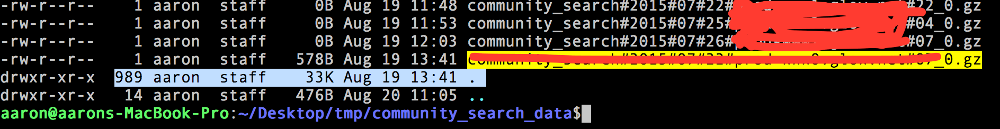

---
category: tools
published: true
layout: post
title: 我常用到的linux命令
description: 记录我80%时间里用到的那些linux命令～
---  


无意间发现这本在线书籍挺好的：[Linux工具快速教程](http://linuxtools-rst.readthedocs.org/zh_CN/latest/)

  
## 1. ps
Linux中的ps命令是Process Status的缩写。ps命令用来列出系统中当前运行的那些进程。ps命令列出的是当前那些进程的快照，就是执行ps命令的那个时刻的那些进程，如果想要动态的显示进程信息，就可以使用top命令。  

要对进程进行监测和控制，首先必须要了解当前进程的情况，也就是需要查看当前进程，而 ps 命令就是最基本同时也是非常强大的进程查看命令。使用该命令可以确定有哪些进程正在运行和运行的状态、进程是否结束、进程有没有僵死、哪些进程占用了过多的资源等等。总之大部分信息都是可以通过执行该命令得到的。     

linux上进程有5种状态:

- `R 运行` : 正在运行或在运行队列中等待    
- `S 中断` : 休眠中, 受阻, 在等待某个条件的形成或接受到信号 
- `D 不可中断` : 收到信号不唤醒和不可运行, 进程必须等待直到有中断发生
- `Z 僵死` : 进程已终止, 但进程描述符存在, 直到父进程调用wait4()系统调用后释放
- `T 停止` : 进程收到SIGSTOP, SIGSTP, SIGTIN, SIGTOU信号后停止运行运行

命令参数：    



a  显示所有进程
-a 显示同一终端下的所有程序
-A 显示所有进程
c  显示进程的真实名称
-N 反向选择
-e 等于“-A”
e  显示环境变量
f  显示程序间的关系
-H 显示树状结构
r  显示当前终端的进程
T  显示当前终端的所有程序
u  指定用户的所有进程
-au 显示较详细的资讯
aux 显示所有包含其他使用者的行程
-C<命令> 列出指定命令的状况
--lines<行数> 每页显示的行数
--width<字符数> 每页显示的字符数
--help 显示帮助信息
--version 显示版本显示



## 2. kill  
　　Linux中的kill命令用来终止指定的进程（terminate a process）的运行，是Linux下进程管理的常用命令。通常，终止一个前台进程可以使用Ctrl+C键，但是，对于一个后台进程就须用kill命令来终止，我们就需要先使用 ps/pidof/pstree/top 等工具获取进程PID，然后使用kill命令来杀掉该进程。kill命令是通过向进程发送指定的信号来结束相应进程的。在默认情况下，采用编号为15的TERM信号。TERM信号将终止所有不能捕获该信号的进程。对于那些可以捕获该信号的进程就要用编号为9的kill信号，强行“杀掉”该进程。   

命令参数：  



-l  信号，若果不加信号的编号参数，则使用“-l”参数会列出全部的信号名称
-a  当处理当前进程时，不限制命令名和进程号的对应关系
-p  指定kill 命令只打印相关进程的进程号，而不发送任何信号
-s  指定发送信号
-u  指定用户




## 3. env

env 命令用于显示系统中已存在的环境变量，以及在定义的环境中执行指令。该命令只使用"-"作为参数选项时，隐藏了选项"-i"的功能。若没有设置任何选项和参数时，则直接显示当前的环境变量。


`经验案例`：

>>
某次在一台不熟悉的机器上运行一个开源项目的时候，老是提示 python 相关的错误，大概是说 python shell 的路径不对，但自己明明在启动项目之前 source 了一些相关的环境配置的。很明显，环境变量中有其他变量配置了 python 的路径。此时可以用 env 来查看当前 shell 下所有的环境配置，果然发现一个 PYTHONPATH 的变量被别人配置过了。


## 4. vimdiff

linux/mac 下对比多个不同文件，多个不同文件以vim方式打开，可编辑保存，不同的地方会有高亮显示。非常实用，我常用来查看不同的配置文件区别。  


有几种方法可以使用vimdiff：   

－ vimdiff file1 file2
－ vim -d file1 file2
－ vim file1 之后打开vim后输入:vertical diffsplit file2

下面是vimdiff中的一些常用快捷键：

- Ctrl-w H（把当前窗口移到最左边）
- Ctrl-w L（把当前窗口移到最右边）
- ]c，跳到下一个差异点
- [c，跳到上一个差异点
- qa，同时退出
- wa，同时保存
- wqa，同时保存并退出
－ qa，同时退出不保存


## 5. head

head 可以用来查看一个文件的前几行，我通常用来查看一个文件的结构。算是最简单的一个命令了，但是很实用啊，当然如果配合其他命令使用起来就更舒服了，比如配合管道做 grep，或者配合管道用 column 来格式化显示csv格式的文件。


## 6. grep

这个命令就不用说了，因为用得太多了。常用来在很多数据里找到匹配某一模式［可以是正则哦，很强大］的字段，我更常用的场景是配合 “tail －f” 来在实时更新的日志里查找一些相关的字段，比如查找某一个请求api，在debug的时候比较常用。

默认的grep是没有高亮匹配字段的，可以在grep 后加上 "--color"来高亮匹配的字段，更方便的做法是 `alias grep="grep --color=auto`，这样每次用grep的时候都有高亮了，用起来更方便。

常用的几个参数：

```
-a 以文本文件方式搜索
-c 计算找到的符合行的次数
-i 忽略大小写
-n 顺便输出行号
-v 反向选择，即找 没有搜索字符串的行
```

## 7. du

以前一直没有用过这么命令，因为都用 `ls` 加上一些参数来查看文件大小。但有一次，我从 AWS S3 上下载了将近1000个文件下来，想查看这一千个文件的总大小，用 `ls -lh' 发现只能查看每个文件的大小，而显示的文件夹大小并不是文件夹下所有文件的大小，而且这个文件夹的一些元信息的大小：  



所以查了半天，才找到 du 这个命令，用起来方便多了。

关于 ls 和 du 这两个命令，我觉得下面这几个帖子值得一看：

- [what-does-size-of-a-directory-mean-in-output-of-ls-l-command](http://unix.stackexchange.com/questions/55/what-does-size-of-a-directory-mean-in-output-of-ls-l-command)
- [file holes/文件黑洞](http://blog.sina.com.cn/s/blog_70122437010122m1.html)


## 8. tail

tail命令和head相反，查看文件的最后几行。不过最常用的还是加上 "-f" 参数后和grep一起使用。


## 9. scp

scp是secure copy的简写，用于在Linux下进行远程拷贝文件的命令，和它类似的命令有cp，不过cp只是在本机进行拷贝不能跨服务器，而且scp传输是加密的。可能会稍微影响一下速度。当你服务器硬盘变为只读 read only system时，用scp可以帮你把文件移出来。另外，scp还非常不占资源，不会提高多少系统负荷，在这一点上，rsync就远远不及它了。虽然 rsync比scp会快一点，但当小文件众多的情况下，rsync会导致硬盘I/O非常高，而scp基本不影响系统正常使用。  

以前在windows下开发的时候，和服务器上的文件上传下载都是通过 securcrt 的sz 和 rz命令，现在用 MAC 了，才知道原来还有这样一个好用的命令，真是弱爆了呀。已经有一篇[文章](http://www.cnblogs.com/peida/archive/2013/03/15/2960802.html)讲这个命令很详细了，我就简单copy一下，把自己常用的参数含义纪录下来。

scp [参数] [原路径] [目标路径]

-B  使用批处理模式（传输过程中不询问传输口令或短语）  
-C  允许压缩。（将-C标志传递给ssh，从而打开压缩功能）  
-p 保留原文件的修改时间，访问时间和访问权限。  
-q  不显示传输进度条。  
-r  递归复制整个目录。  
-v 详细方式显示输出。scp和ssh(1)会显示出整个过程的调试信息。这些信息用于调试连接，验证和配置问题。   
-F ssh_config  指定一个替代的ssh配置文件，此参数直接传递给ssh。  
-i identity_file  从指定文件中读取传输时使用的密钥文件，此参数直接传递给ssh。    
-l limit  限定用户所能使用的带宽，以Kbit/s为单位。     
-P port  注意是大写的P, port是指定数据传输用到的端口号   


## 10. wc

wc -- word, line, character, and byte count


## 参考

- [技巧：Vimdiff 使用](http://www.ibm.com/developerworks/cn/linux/l-vimdiff/)
- [Linux 命令大全](http://man.linuxde.net/)